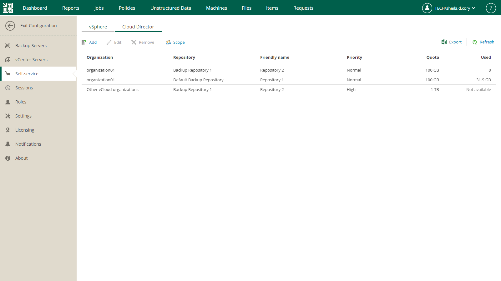
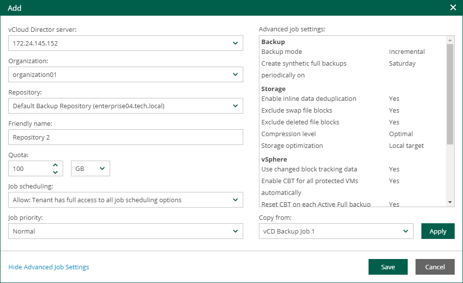

In this article

Users with the Portal Administrator role can add a new configuration for a VMware Cloud Director organization. Each configuration defines a backup repository that can be used by the organization, repository quota and backup job settings.

You can specify multiple repositories per organization. In this case, users of Veeam Self-Service Backup Portal will be able to select a backup repository when configuring their jobs. For details, see [Creating Jobs](cd_creating_jobs.md). To specify multiple repositories per organization, add a separate configuration for each repository.

Before you add a new configuration, [check prerequisites](em_managing_vcd_org.md).

To add a new organization configuration:

1. Log in to Veeam Backup Enterprise Manager using an administrative account.
2. Click Configuration in the upper-right corner.
3. In the Configuration view, select the Self-service section.
4. In the Self-service section, select the Cloud Director tab.

1. To add a new configuration, click Add.
2. From the VMware Cloud Director server drop-down list, select a VMware Cloud Director server you need.

The field is available if you have multiple Cloud Director servers in the Enterprise Manager infrastructure.

1. From the Organization drop-down list, select an organization you need. The list contains organizations from the selected Cloud Director server processed by the backup server that is added to Enterprise Manager.
2. From the Repository drop-down list, select a repository that will be used for backups. The list includes repositories configured on backup servers that has a Cloud Director server added to its infrastructure.

|  |
| --- |
| Important |
| You cannot assign cloud-based repositories, as well as NetApp or Nimble storage systems storing snapshots created by [snapshot-only jobs](https://helpcenter.veeam.com/docs/vbr/userguide/snapshot_only_job_perform.html?ver=13). |

1. In the Friendly name field, specify a repository name that will be displayed to organization members.
2. In the Quota section, specify a repository storage quota. You can choose GB or TB from the drop-down list and enter the required quantity. For details on the quota usage see [About Organization Quota](vcd_organization_quota.md).
3. From the Job scheduling drop-down list, select one of the following options:

1. Allow: Tenant has full access to all job scheduling options
2. Allow: Tenant can create daily and monthly jobs only
3. Deny: Creates daily jobs with randomized start time within the backup window

For backup jobs of Cloud Director organizations, the backup window settings are specified in Veeam Backup Enterprise Manager. Backup window settings specified for the job template that you will select from the advanced job settings do not affect organization jobs. For information on how to specify the backup window in Veeam Backup Enterprise Manager, see [Customizing Dashboard Chart](customizing_dashboard_chart.md).

1. Deny: Creates job with no schedule assigned

For more information on job scheduling, see [Edit Job Schedule](jobs_edit_schedule.md).

1. Specify advanced settings for backup jobs of the Cloud Director organization.

1. Click the Show Advanced Job Settings link.
2. In the Advanced job settings section, view the currently used backup job settings.
3. From the Copy from list, select the advanced settings that you want to apply to backup jobs of the Cloud Director organization. For more information on the specific settings, see the [Specify Advanced Backup Settings](https://helpcenter.veeam.com/docs/vbr/userguide/backup_job_advanced_vm.html?ver=13) section of the Veeam Backup & Replication User Guide.

* Select Default settings to use the default advanced settings as they are shown in the Veeam Backup & Replication console. This option is applied by default.
* Select <Job name> to use the advanced settings of an existing backup job as a template. When an organization member creates a backup job on the Veeam Self-Service Backup Portal, Enterprise Manager will copy the advanced settings from the template and apply them to the job.

Note that, in the Copy from list, Enterprise Manager displays only VMware Cloud Director backup jobs that are configured in advance on the backup server added to Enterprise Manager.

1. To apply the job template, click Apply.

|  |
| --- |
| Important |
| The backup repository that is selected from the Repository drop-down list for the organization takes priority over the repository used by the selected job template. |

1. To save the configuration, click Save.

Page updated 10/30/2025

Page content applies to build 13.0.1.1071
