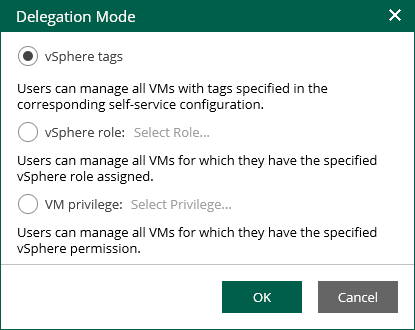

In this article

To define what VMs the tenants of vSphere Self-Service Backup Portal can back up and restore, the Enterprise Manager administrator can configure the delegation mode. The delegation mode specifies conditions that must be met to allow a tenant to add a VM to the backup job.

Before you configure the delegation mode, make sure the following requirements are met:

* If you have configured a single sign-on service to access vSphere Self-Service Backup Portal, you must use the delegation mode based on vSphere tags only. For more information on single sign-on, see [SAML Authentication Support](em_saml.md).
* The vSphere tab is not displayed if all your vCenter Servers are added as part of VMware Cloud Director infrastructure and you do not have any tenant accounts that were previously added for one of the VMware vCenter Servers.

* If you change the delegation mode when tenants already work with vSphere Self-Service Backup Portal, tenants can lose access to VMs that were available to them according to the original delegation mode. Make sure that the necessary tags, roles or privileges are configured in VMware vSphere.

To configure the delegation mode, take the following steps:

1. Log in to Veeam Backup Enterprise Manager using an administrative account.
2. To open the Configuration view, click Configuration in the upper-right corner.
3. In the Configuration view, select the Self-service section.

The Self-service section is available if you have added to Enterprise Manager at least one backup server with a vCenter Server as part of its infrastructure.

1. If a VMware Cloud Director server is added to your backup infrastructure, make sure that the vSphere tab is selected.
2. In the Delegation Mode window, select a delegation mode:

* vSphere tags — to allow tenants to work with VMs to which the specified tags are assigned. If you select this option, you must specify the necessary tags in the properties of the tenant account. You can specify tags for each tenant account individually. For more information, see [Adding Tenant Account](em_adding_tenant_accounts.md) and [Editing Tenant Account](em_editing_tenant_accounts.md).

|  |
| --- |
| Note |
| To enable your tenants to restore entire VMs to a new location, you must assign the specified tags to all VMware vSphere parent objects in the target location, including the host, VM folder, resource pool, datastore and network. |

* vSphere role — to allow tenants to work with VMs that are available to the specified vSphere role.

To specify a vSphere role:

1. Next to the vSphere role option, click Select Role.

Alternatively, if you have already selected a role before, click the name of the currently selected role.

1. In the Select Role window, select the required vSphere role.
2. Click OK.

* VM privilege — to allow tenants to work with VMs for which they have the specified vSphere privilege.

To select a vSphere privilege:

1. In the VM privilege field, click the name of the currently selected privilege. By default, the VirtualMachine.Interact.Backup privilege is selected.
2. In the Select Privilege window, select the required privilege.
3. Click OK.

1. Click OK to apply the changes.

Page updated 10/30/2025

Page content applies to build 13.0.1.1071
