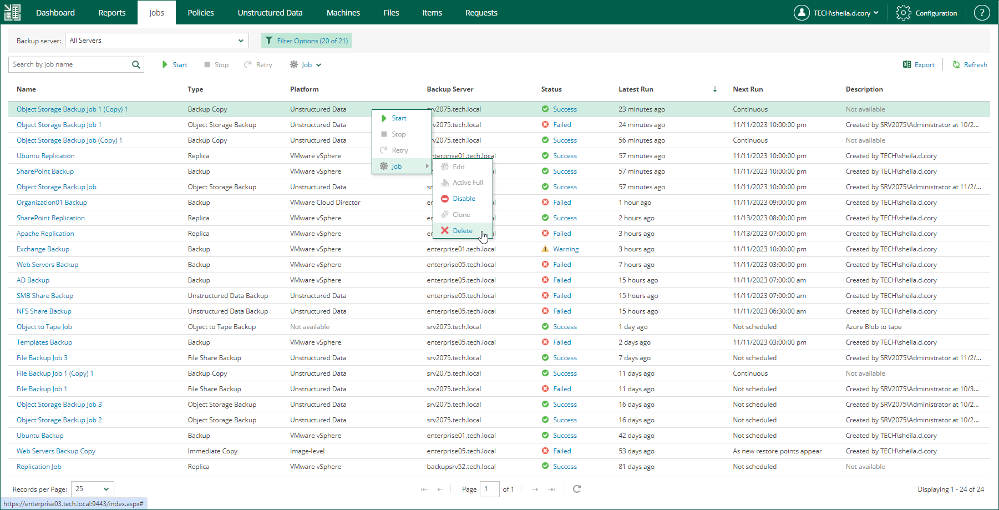
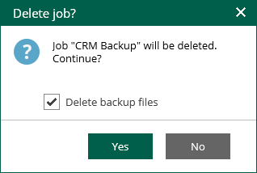

# Deleting Jobs

Users with the Portal Administrator role can delete a job and also instruct Veeam Backup Enterprise Manager to delete backup files created by this job in the backup repository. Deleted jobs will no longer appear in the UI. They will be removed from the Enterprise Manager database and from the Veeam Backup configuration database on the backup server. If you select to delete backup files, they will be removed from backup repository.

If you have backup servers of earlier versions added to Enterprise Manager, the jobs managed by these servers cannot be deleted using Enterprise Manager.

To delete a job, take the following steps:

1. On the Jobs tab, select the required job in the list.
2. Expand the menu commands by clicking Job, then select Delete.

1. You will be prompted to delete backup files. To delete backup files, select the Delete backup files check box and click Yes to confirm the operation.

If four-eyes authorization is enabled on the backup server, backup files will remain in the backup repository and become orphaned.

