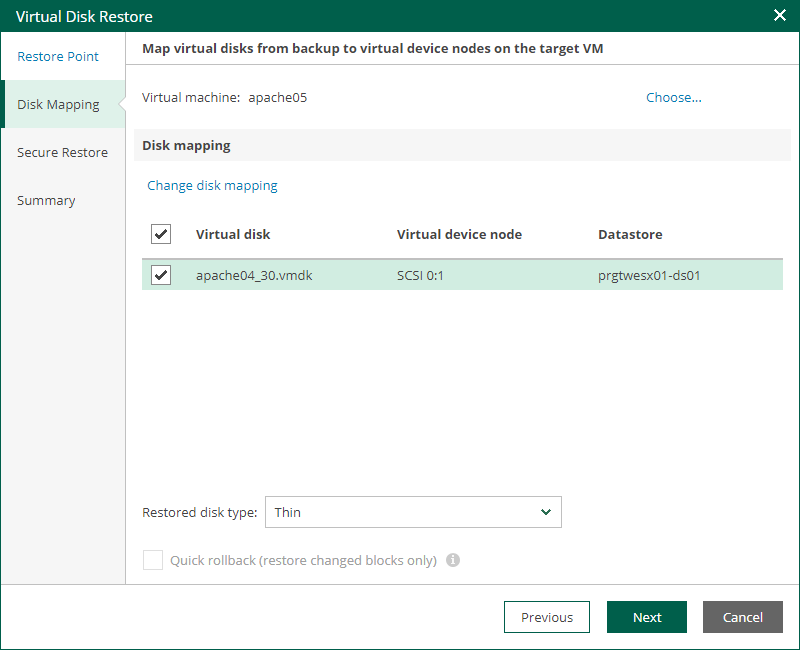
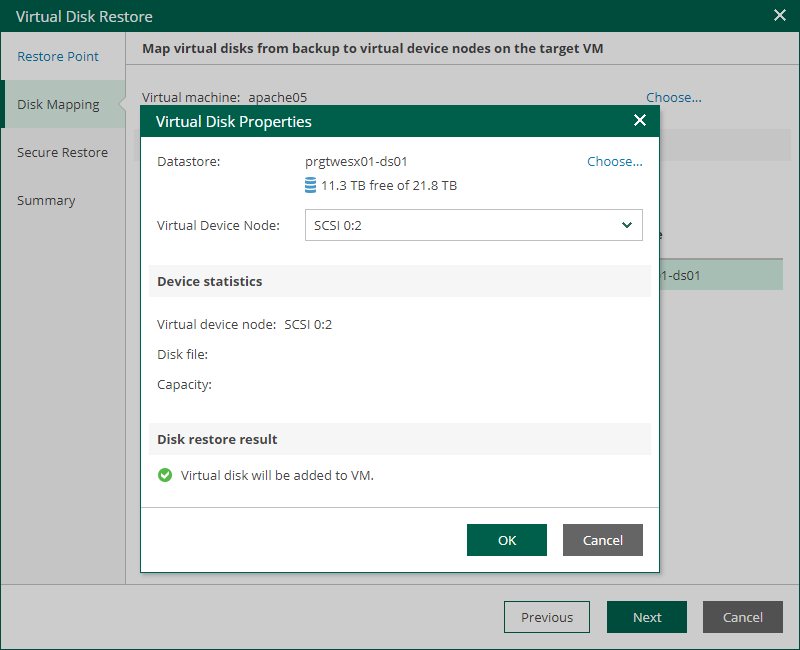

In this article

At the Disk Mapping step of the wizard, specify VM disk restore settings.

1. By default, Veeam Backup Enterprise Manager restores virtual disks to the original VM. To select another VM, click Choose next to the Virtual machine field and select the necessary VM from the virtual environment.

You cannot attach restored disks to a VM that has one or more snapshots.

1. In the Disk Mapping section, select check boxes next to the virtual disks that you want to restore.
2. By default, virtual disks are restored in the original format. To change the disk format, select the necessary option from the Restore disks list: Same as source, Thin, Thick (lazy zeroed) or Thick (eager zeroed). For more information about virtual disk formats, see the [Virtual Disk Options](https://techdocs.broadcom.com/us/en/vmware-cis/vsphere/vsphere/8-0/vsphere-storage-8-0/using-vmkfstools-in-vsphere/virtual-disk-options-of-vsphere-vmkfstools-command.html) section of the VMware vSphere documentation.

Disk format change is supported only for VMs with Virtual Hardware version 7 or later.

1. [For disk restore to the original location and with original format] Instead of restoring an entire virtual disk from a backup file, you can instruct Enterprise Manager to recover only those data blocks that are necessary to revert the disk to the selected restore point. To do this, select the Quick rollback check box. Quick rollback significantly reduces the recovery time and has little impact on the production environment.

Enable this option if you restore a VM disk after a problem that occurred at the level of the VM guest OS: for example, there has been an application error or a user has accidentally deleted a file on the VM guest OS. Do not enable this option if the problem has occurred at the VM hardware level, storage level or due to a power loss.

1. By default, virtual disks are restored to the target machine with the original properties. To change disk properties, take the following steps for each disk:

1. In the Disk Mapping section, select the necessary virtual disk and click the Change disk mapping link.
2. In the Virtual Disk Properties window, click Choose next to the Datastore field and select a datastore where the virtual disk file will be placed.
3. From the Virtual Device Node list, select a virtual device node for the restored disk on the target VM:

* If you want to replace an existing virtual disk, select an occupied virtual device node.
* If you want to attach the restored disk to the VM as a new drive, select a node that is not occupied yet.

Page updated 2/7/2025

Page content applies to build 13.0.1.1071
