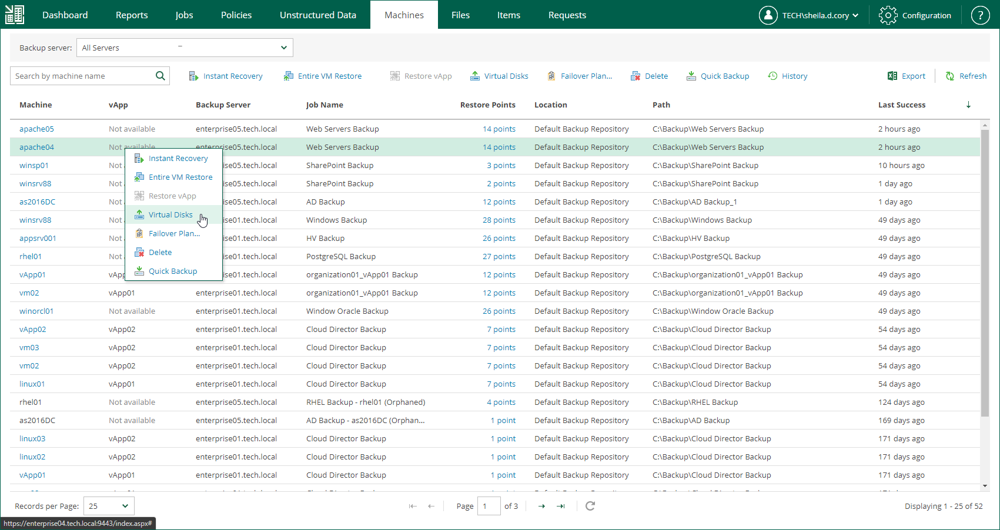

In this article

To launch the Virtual Disk Restore wizard, do the following:

1. Open the Machines tab and select the necessary VMware vSphere VM from the list.

To quickly find a machine, you can filter machines in the list by a backup server or search for a specific machine by machine name.

1. On the toolbar, click Virtual Disks.

Alternatively, you can right-click the VM and select Virtual Disks.

Page updated 7/28/2023

Page content applies to build 13.0.1.1071
