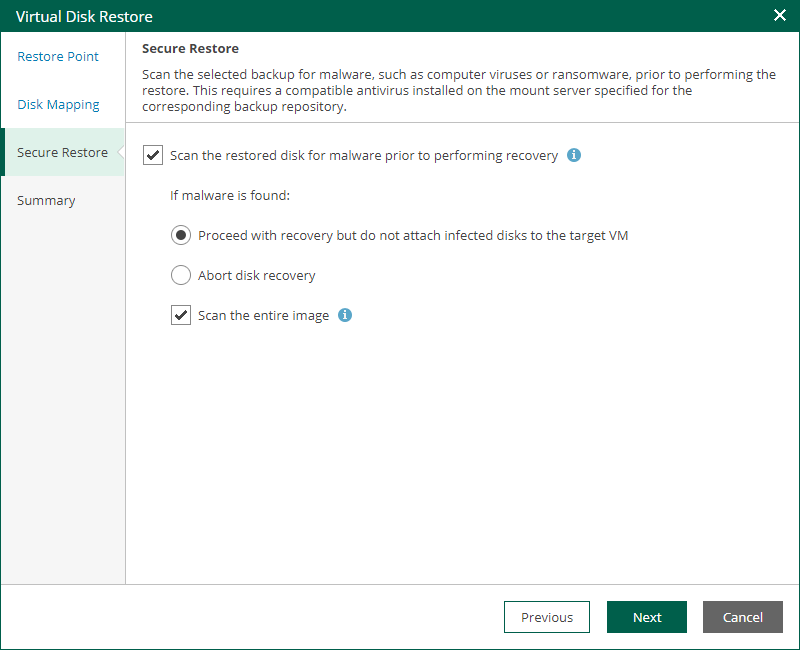

In this article

At the Secure Restore step of the wizard, you can instruct Veeam Backup & Replication to perform secure restore — scan virtual disk data with antivirus software before restoring the disk. For more information on secure restore, see the [Secure Restore](https://helpcenter.veeam.com/docs/vbr/userguide/av_scan_about.html?ver=13) section of the Veeam Backup & Replication User Guide.

To specify secure restore settings, do the following:

1. Select the Scan the restored disk for malware prior to performing recovery check box.
2. Select the action that Veeam Backup & Replication will take if the antivirus finds a virus threat:

* Select Proceed with recovery but do not attach infected disks to the target VM if you want to continue the virtual disk restore. In this case, the restored disk will not be attached to the target VM.
* Select Abort disk recovery if you want to cancel the restore session.

1. Select the Scan the entire image check box if you want the antivirus to continue the machine data scan after the first malware is found.

Page updated 9/4/2025

Page content applies to build 13.0.1.1071
