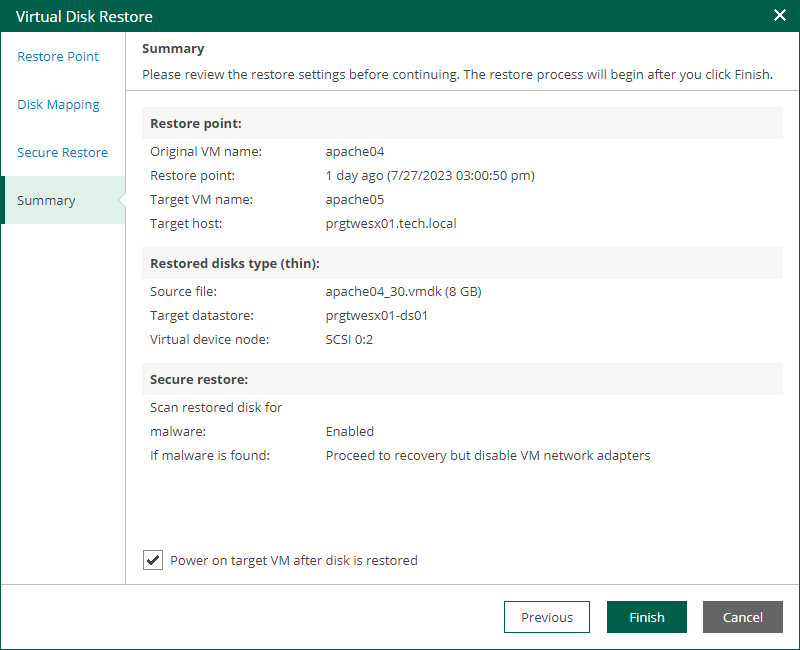

In this article

At the Summary step of the wizard, review the restore settings. To start a VM immediately after the restore process completes, select the Power on target VM after disk is restored check box. Then click Finish.

To view the progress of the virtual disk restore operation, on the Machines tab, click History.

Page updated 9/4/2025

Page content applies to build 13.0.1.1071
