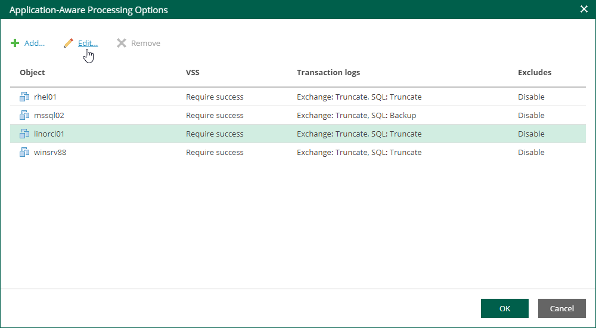

# Application-Aware Processing

At the Guest Processing step of the wizard, you can enable application-aware processing. Application-aware processing is a Veeam technology based on Microsoft VSS and used to create transactionally consistent backups or replicas of VMs that run Microsoft Active Directory, Microsoft SQL Server, Microsoft SharePoint, Microsoft Exchange, Oracle or PostgreSQL. For more information, see the [Application-Aware Processing](https://helpcenter.veeam.com/docs/vbr/userguide/application_aware_processing.html?ver=13) section of the Veeam Backup & Replication User Guide.

To configure application-aware processing, take the following steps:

1. Select the Enable application-aware processing check box.
2. Click the Customize Application link.
3. To define custom settings for a machine, select it and click Edit.

To customize settings of a machine added to the job as part of a container, add the machine as a standalone instance. For that, click Add machine and choose the necessary VM. Next, select the machine from the list and click Edit to customize VM settings.

To discard custom settings of a machine, select the machine in the list and click Remove.

1. Configure the necessary settings for the selected application server:

* [General Settings](jobs_aap_general.md)
* [Microsoft SQL Server Transaction Log Settings](jobs_aap_sql.md)
* [Oracle Archived Redo Log Settings](jobs_aap_oracle.md)
* [PostgreSQL Archive Log Settings](jobs_aap_postgresql.md)
* [VM Guest OS File Exclusion](jobs_aap_file_exclusions.md)

