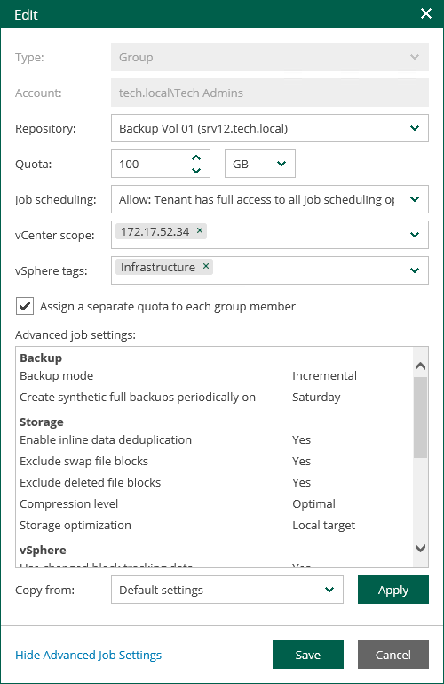

In this article

The Veeam Backup Enterprise Manager administrator can edit tenant accounts configured for vSphere Self-Service Backup Portal. For example, the administrator changes backup scheduling settings or other settings for tenant backup jobs.

Consider the following recommendations for modifying tenant account settings for vSphere Self-Service Backup Portal:

* Make sure to establish a proper connection between the backup server and Enterprise Manager server. Otherwise, the changes of the tenant account settings will not be saved to the configuration database.

* If you plan to modify job template for a tenant account, remember that the new settings will be applied only to the new jobs created by the tenant; the changes will not affect existing jobs.
* If you want an existing backup job to create backups in another backup repository instead of the repository that is currently specified in the properties of the tenant account, do the following:

1. In Veeam Backup Enterprise Manager, specify the new backup repository in the properties of the tenant account.
2. Move vSphere VM backups created by the tenant to the new repository.
3. In Veeam Backup & Replication, specify the new backup repository in the properties of tenant backup jobs.

Otherwise, tenant backup jobs will continue creating backups in the former repository.

To change settings of a tenant account:

1. Log in to Veeam Backup Enterprise Manager using an administrative account.
2. To open the Configuration view, click Configuration in the upper-right corner.
3. In the Configuration view, select the Self-service section.

The Self-service section is available if you have added to Enterprise Manager at least one Veeam backup server with a vCenter Server as part of its infrastructure.

1. If a VMware Cloud Director server is added to your Veeam backup infrastructure, make sure that the vSphere tab is selected.
2. Select the account you need and click Edit.
3. In the Edit window, edit tenant account settings as required. For more information, see [Adding Tenant Account](em_adding_tenant_accounts.md).
4. Click Save.

Page updated 10/30/2025

Page content applies to build 13.0.1.1071
