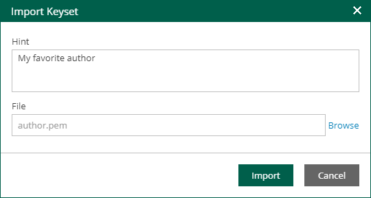

# Exporting and Importing Enterprise Manager Keyset

It is important to regularly back up your Enterprise Manager keys or save their copies in a safe place. If you lose a password for an encrypted backup or tape, you can unlock this backup or tape with the private Enterprise Manager key and the Enterprise Keys Restore wizard.

However, in some situations, a matching private Enterprise Manager key may be not available. This can happen, for example, if your Veeam Backup Enterprise Manager database has failed or you use a new installation of Veeam Backup Enterprise Manager and a new database. In this case, Veeam Backup Enterprise Manager will not find a matching private Enterprise Manager key in the database and will be unable to unlock the backup or tape encrypted with the public Enterprise Manager key.

You can create a backup copy of an Enterprise Manager keyset with the export operation in Veeam Backup Enterprise Manager. The exported keyset is saved as a file of the PEM format and contains private and public Enterprise Manager keys. You can save the exported keyset on the local disk or on a network share. An exported keyset can be imported back to Veeam Backup Enterprise Manager any time you need.

To export a keyset:

1. In Veeam Backup Enterprise Manager, open the Settings section of the Configuration view.
2. On the Key Management tab, in the Managed keys section, select a keyset you want to back up and click Export.
3. Save the resulting PEM file on the local disk or in a network shared folder.

To import a previously exported keyset:

1. In Veeam Backup Enterprise Manager, open the Settings section of the Configuration view.
2. On the Key Management tab, in the Managed keys section, click Import.
3. Click Browse next to the File field and select a previously exported keyset.
4. In the Hint field, Veeam Backup Enterprise Manager displays a hint that you provided when creating the imported keyset.
5. Click Import.

When you import a keyset, it is saved to the Veeam Backup Enterprise Manager database and displayed in the keyset list in Veeam Backup Enterprise Manager.

|  |
| --- |
| Note |
| An imported keyset has the Inactive state. You must activate it to be able to use the keys from the keyset for backup encryption (for restore procedures, activation is not necessary). For more information, see [Activating Enterprise Manager Keyset](em_activate_em_keys.md). |

