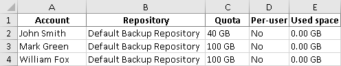

In this article

The Veeam Backup Enterprise Manager administrator can generate a report on tenant accounts configured for vSphere Self-Service Backup Portal. This report includes information on the account name, backup repository used by the account, storage quota allocated to the account, and space used by the account.

To generate a report:

1. Log in to Veeam Backup Enterprise Manager using an administrative account.
2. To open the Configuration view, click Configuration in the upper-right corner.
3. In the Configuration view, select the Self-service section.

The Self-service section is available if you have added to Enterprise Manager at least one Veeam backup server with a vCenter Server as part of its infrastructure.

1. If a VMware Cloud Director server is added to your Veeam backup infrastructure, make sure that the vSphere tab is selected.
2. Click the Export link in the upper-right corner.

The report is saved to the excelreport.xls file.

Page updated 10/30/2025

Page content applies to build 13.0.1.1071
