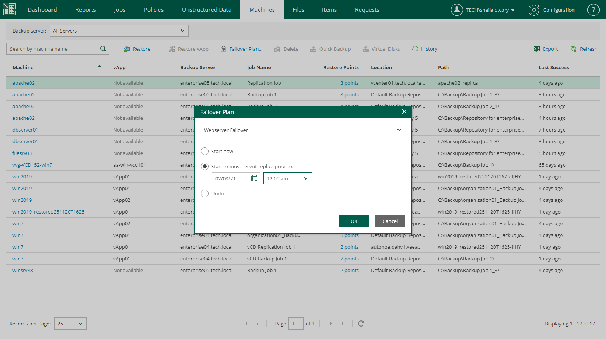

In this article

This feature is not available for physical machine backups. If your infrastructure comprises machines running interdependent applications (for example, Exchange Server and domain controller), it is reasonable to failover them one by one, as a group. To do this automatically, you can prepare a failover plan using Veeam Backup & Replication console.

In Veeam Backup Enterprise Manager, you can run failover plans created in Veeam Backup & Replication console for VMware vSphere and Microsoft Hyper-V VMs.

Failover plan sets the following:

* The order in which the machines should be processed: for example, AD domain services server first, Exchange server after it.
* The delay time needed to start each machine. The delay time helps to ensure that certain machines (AD domain services server in our example) are already running at the time the dependent machines start.

The failover process is performed in the following way (either ad-hoc or on schedule):

1. For each machine included in the plan, Veeam Backup & Replication detects its replica (the machines whose replicas are already in Failover or Failback state are skipped from processing).
2. The replica machines are started sequentially, in the order they appear in the failover plan, within the set time intervals.

Consider that failover is a temporary intermediate step that needs to be finalized. The finalizing options for a group failover are similar to a regular failover: undoing failover, permanent failover or failback. To learn more about failover planning and recommended course of action, refer to Veeam Backup & Replication User Guide.

Veeam Backup Enterprise Manager allows you to carry out a failover following the existing plan, and also to undo planned failover.

|  |
| --- |
| Note |
| For failover plan creation, as well as for permanent failover or failback, use the Veeam Backup & Replication console. |

Running Failover Plans

To run a failover plan:

1. Log in to Enterprise Manager using an administrative account or user account whose restore scope contains the machines from the failover plan.
2. Go to the Machines tab and click Failover Plan.
3. In the Failover Plan window, select the necessary plan from the list, then specify the starting option you need.

The following options are available for a failover plan:

* Start now — use this option if you need to fail over to the replicas’ latest restore point.
* Start to most recent replica prior to — use this option if you need to fail over to a certain restore point. For example, you may want your application server to failover to a state prior to the upgrade. In this case, for each machine participating in failover, Veeam will find the closest restore point (prior to the specified date and time) and fail over to it.
* Undo — use this option to switch the workload back to source machines discarding the changes that were made to the replicas during failover.

1. Click OK and wait for the process to complete.

To view the failover progress, on the Machines tab, click History.

Page updated 9/2/2025

Page content applies to build 13.0.1.1071
