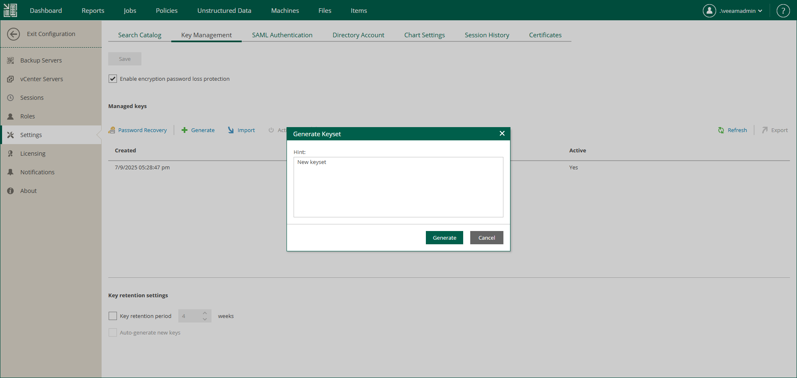

In this article

For safety’s sake, periodically generate a new pair of Enterprise Manager keys. Regular change of encryption keys raises the encryption security level.

Enterprise Manager keys are created in the inactive state. To make the keys active and use them for encryption and decryption, you need to activate the keys. For details, see [Activating Enterprise Manager Keyset](em_activate_em_keys.md).

To generate a new Enterprise Manager keyset:

1. In Veeam Backup Enterprise Manager, open the Settings section of the Configuration view.
2. On the Key Management tab, in the Managed keys section, click Generate.
3. In the Generate Keyset window, enter a description for the created keyset. The keyset description will help you to distinguish the created keyset in the list.
4. Click Generate.

Page updated 11/10/2025

Page content applies to build 13.0.1.1071
