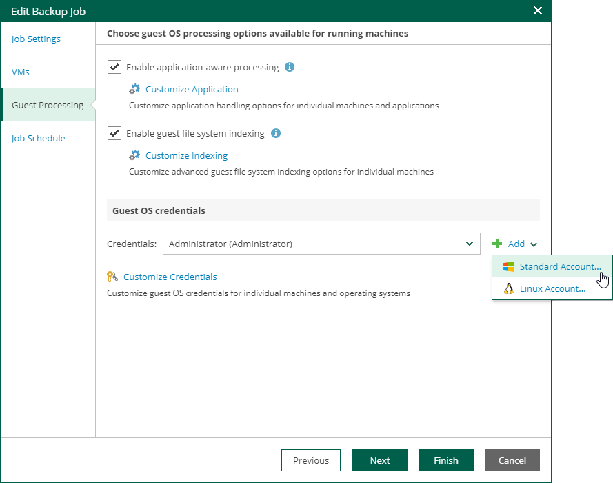
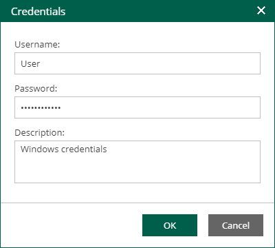
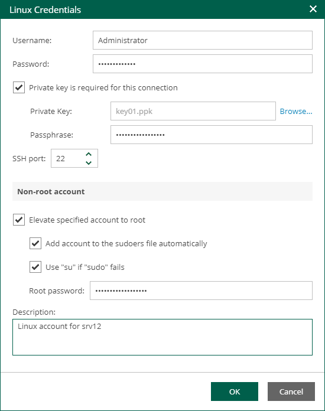
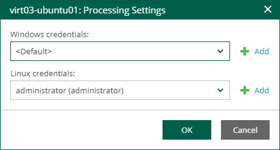

In this article

If you specify guest OS credentials, Veeam Backup & Replication deploys a runtime process on the VM guest OS to coordinate guest processing activities. The process runs only during guest processing and is stopped immediately after the processing is finished.

If you have Management Agent installed on a Linux VM, you have an option to use it for coordinating guest processing activities. In this case, guest OS credentials are not stored in the configuration database, which makes using Management Agent a more secure option. For more information, see the [Persistent Agent Components](https://helpcenter.veeam.com/docs/vbr/userguide/persistent_agent_components.html?ver=13) section of the Veeam Backup & Replication User Guide.

In the Guest OS credentials section, you can select credentials from the list, or click the Add button to add new credentials.

* For Windows guest OS, specify a user account (name and password) with local administrative rights on target machine, and optional description. Credentials must be specified in the following format:

* For Active Directory accounts: DOMAIN\Username
* For local accounts: Username or HOST\Username

* For Linux guest OS, you can choose one of the following options:

* If Management Agent is installed on the VM, you can select the Use management agent option.
* If Management Agent is not installed on the VM, specify a user name, password, and SSH port (by default, port 22 is used).

If you specify data for a non-root account that does not have root privileges on a Linux server, you can use the Non-root account section to grant this account elevated permissions as follows:

1. To provide a non-root user with root account privileges, select the Elevate specified account to root check box.
2. To add the user account to the sudoers file, select the Add account to the sudoers file automatically check box. In the Root password field, enter the root account password.

If you do not enable this option, you will have to manually add the user account to the sudoers file.

1. If you plan to use the account to connect to Linux servers where the sudo command is not available or may fail, you have an option to use the su command instead. To enable the su command, select the Use "su" if "sudo" fails check box and in the Root password field, enter the root account password.

Veeam Backup & Replication will first try to use the sudo command. If the attempt fails, Veeam Backup & Replication will use the su command.

|  |
| --- |
| Important |
| For machine guest OS indexing of Linux-based machines, a user account with root privileges on the machine is required. It is recommended that you create a separate user account for work with Veeam Backup & Replication on the Linux-based machine, grant root privileges to this account and specify settings of this account in the Guest OS credentials section.  It is also recommended to avoid additional commands output for the specified user (like messages echoed from within ~/.bashrc or command traces before execution), because they may affect Linux machine processing. |

Linux Private Key

Another option is to use Linux private key. This method eliminates the need to supply password at each login, helps to protect against malicious applications like keyloggers, thus strengthening security, and simplifies launch of automated tasks, decreasing administrative load in Linux environments. For this method, a user must create a pair of keys:

* Private key is stored on the client (user’s) machine — that is, on the machine where Veeam Backup & Replication runs. The key is usually stored in the encrypted form. To decrypt a private key, you need to supply a passphrase specified at key creation.
* Public key is stored on the server (Linux machine) in a special authorized\_keys file that contains a list of public keys.

If you plan to use Linux private key for authentication, make sure you have created private and public keys and stored them appropriately: private key on the client side (Veeam backup server) and public key on the server side (Linux machine). You should also have the passphrase for the private key if it is encrypted. If you select to use Linux private key credentials, you should specify the following:

* User name
* Passphrase for private key
* Private key stored on the client side (Veeam backup server)
* SSH port (default is 22)
* Non-root account elevation options

Special Credentials for Machine

By default, for all machines in the list, Veeam Backup & Replication uses common credentials you provided in the Guest OS credentials section. To use a different account for deploying the agent inside a specific machine, you can customize credentials for the machine.

To customize credentials:

1. In the Guest OS credentials section, select Customize Credentials.
2. Select the necessary machine from the list and click Set User.
3. Specify custom guest OS credentials and click OK.

To remove custom credentials for a machine:

1. In the Guest OS credentials section, select Customize Credentials.
2. Select the necessary machine from the list and click Remove.

|  |
| --- |
| Note |
| To customize settings of a machine added as part of a container, the machine should be included in the list as a standalone instance. For that, click Add machine and choose a machine whose settings you want to customize. |

Page updated 11/10/2025

Page content applies to build 13.0.1.1071
