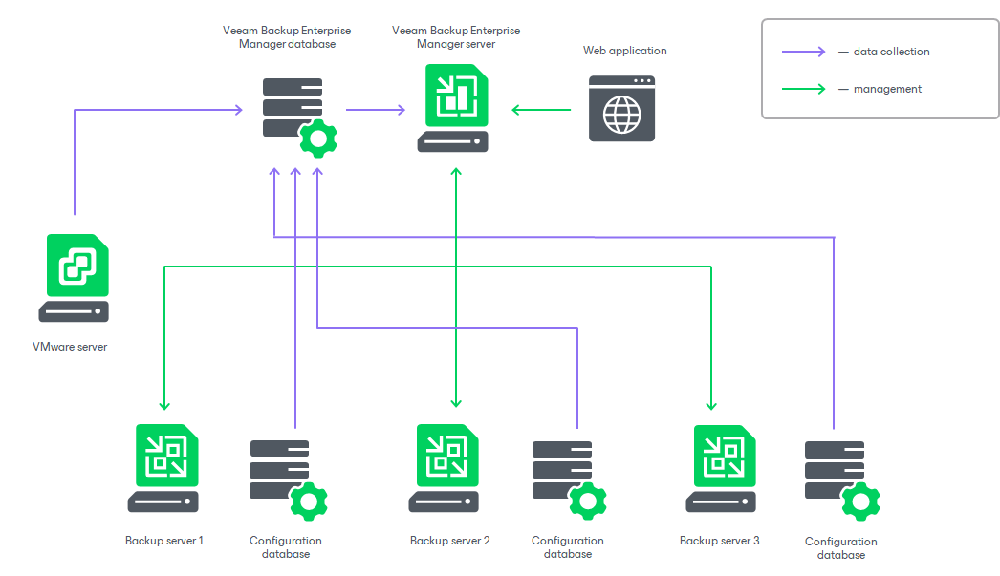

In this article

Veeam Backup Enterprise Manager aggregates data from multiple backup servers, as well as from the underlying VMware vCenter Servers.

1. Veeam Backup Enterprise Manager retrieves data from managed backup servers using a data collection job. This job gets information about the backup and replication jobs, processed machines, and other data from the configuration databases used by backup servers.

If a backup server is added as a High Availability cluster, Enterprise Manager collects the data from an active cluster node. After a node switchover, Enterprise Manager will automatically collect the data from the other active node.

1. Collected data is stored to the Veeam Backup Enterprise Manager database and can be accessed by multiple users from the web interface. This web interface also allows for modifying job settings, license management, installing Veeam plug-in on vCenter Server, and other tasks.
2. When a user modifies a backup job using Veeam Backup Enterprise Manager, these changes are communicated to the backup server that manages the job and stored in its configuration database.

If you have a Veeam Agent integrated with Veeam Backup & Replication, you can use Veeam Backup Enterprise Manager to browse and restore guest OS files and application items from a backup stored in a Veeam backup repository. These processes involve appropriate backup job setup, as well as mount and data transfer operations. For more information, see [Veeam Agents Support](em_support_physical.md).

Related Topics

[Enterprise Manager Components](em_components.md)

Page updated 11/3/2025

Page content applies to build 13.0.1.1071
