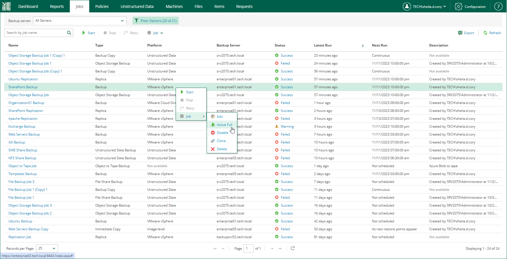

# Creating Active Full Backups

You can create an ad-hoc full backup — active full backup, and add it to the backup chain in the backup repository. The active full backup resets the backup chain. All subsequent incremental backups use the active full backup as a starting point. The previously used full backup will remain in the backup repository until it is removed from the backup chain according to the retention policy.

|  |
| --- |
| Note |
| Creating active full backups is unavailable for backup copy jobs, file backup jobs and object storage backup jobs. |

To perform an active full backup:

1. Select the required job in the list on the Jobs tab.
2. Expand the menu commands by clicking Job, then select Active Full.

