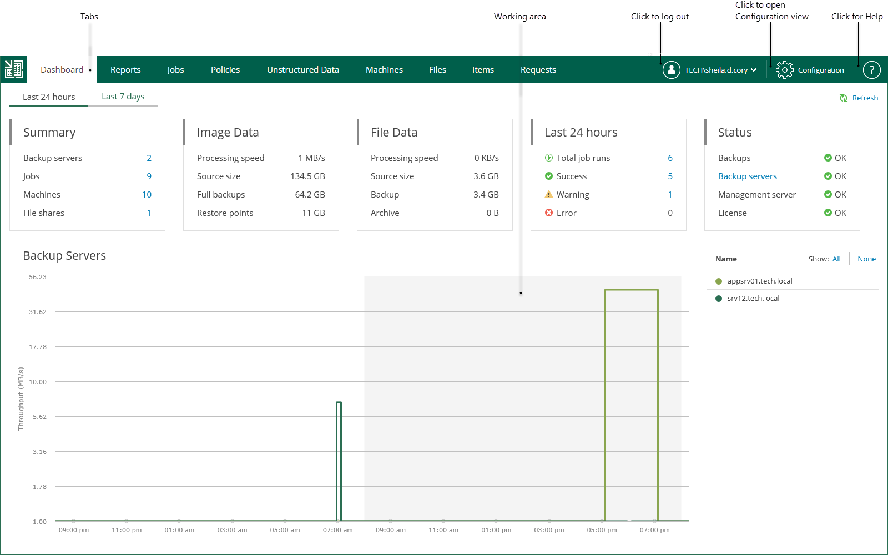
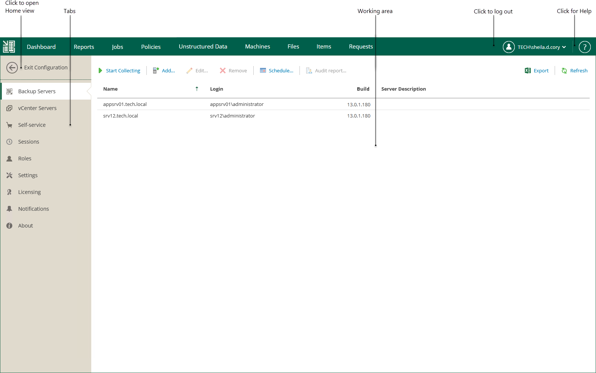

In this article

The user interface of Veeam Backup Enterprise Manager consists of two views.

* The Home view allows you to view on-going statistics on added backup servers, manage jobs and CDP policies, and perform recovery operations.
* The Configuration view allows you to add backup servers to Enterprise Manager, modify Enterprise Manager settings, and configure self-service restore portals.

|  |
| --- |
| Tip |
| To open online help, click the question mark at the top-right of the window. You will be redirected to the section of the user guide that explains the features and options available on the open tab. |

Home View

After you log in to Veeam Backup Enterprise Manager, the Home view opens. In the Home view, you can navigate through tabs to perform management and restore operations. A user can navigate only the tabs they are authorized to view in accordance with their security role. For more information on the Enterprise Manager roles and operations allowed to them, see [Configuring Accounts and Roles](veeam_backup_em_roles.md).

Below is the list of operations that you can perform in the Home view of the Veeam Backup Enterprise Manager UI:

* View on-going statistics for your backup infrastructure using the Dashboard tab. For more information, see [Viewing Dashboard](ongoing_reporting_data.md).
* View detailed information about backup servers managed by Enterprise Manager using the Reports tab. For more information, see [Reports on Backup Servers](reports_on_backup_servers.md).
* Manage jobs on all managed backup servers using the Jobs tab. For more information, see [Managing Jobs](managing_jobs.md).
* Manage CDP policies on all managed backup servers using the Policies tab. For more information, see [Managing CDP Policies](cdp_manage_policies.md).
* Browse for unstructured data backups, search for specific items, delete file shares and recover items from unstructured data backups using the Unstructured Data tab. For more information, see [Working with Unstructured Data](em_managing_file_shares.md).
* Browse for machine backups, search for machines, delete machines and perform failover and replication operations with managed virtual or physical machines using the Machines tab. For more information, see [Working with Machines](em_managing_vms.md).
* Browse the guest OS file system in a machine backup, search for guest OS files and restore necessary files using the Files tab. For more information, see [Guest OS File Restore](searching_restoring_vm_guest_files.md).
* Perform item-level recovery from application-aware backups created by Veeam Backup & Replication using the Items tab. For more information, see [Application Item Restore](em_backup_restore_app_items.md).

Configuration View

If you log in with an administrative account, you can click Configuration to open the Configuration view.

The navigation pane, located on the left of the window, allows you to navigate to the configuration settings you need, for example, notifications, security roles, and others. The working area is located on the right; it allows you to view data, perform the necessary operations or manage the settings you need.

Below is the list of operations that you can perform in the Configuration view of the Veeam Backup Enterprise Manager UI:

* Add, edit or remove Veeam Backup servers using the Backup Servers tab. For more information, see [Managing Backup Servers](managing_backup_servers.md).
* Work with vCenter Servers managed by Enterprise Manager using the vCenter Servers tab. For more information, see [Viewing vCenter Servers](viewing_vc_info.md).
* Manage VMware Cloud Director organizations and vSphere tenant accounts using the Self-Service tab. For more information, see [Veeam Self-Service Backup Portal for Cloud Director](em_working_with_vcd_vms.md) and [vSphere Self-Service Backup Portal](em_working_with_vsphere_portal.md).
* View and manage data collection job sessions using the Sessions tab. For more information, see [Collecting Data from Backup Servers](collecting_data_from_backup_servers.md).
* Configure Enterprise Manager security roles using the Roles tab. For more information, see [Configuring Accounts and Roles](veeam_backup_em_roles.md).
* Configure Enterprise Manager settings using the Settings tab. For more information, see [Managing Encryption Keys](em_manage_keys.md), [Configuring SAML Authentication Settings](veeam_backup_em_saml.md), [Customizing Dashboard Chart](customizing_dashboard_chart.md) and [Configuring Retention Settings for Index and History](configuring_retention_settings.md).
* Manage licenses and view detailed reports on license consumption using the Licensing tab. For more information, see [Licensing](managing_licenses.md).
* Set email notifications using the Notifications tab. For more information, see [Configuring Notification Settings](configuring_notification_settings.md).
* View product versions, URLs and log locations using the About tab. For more information, see [Viewing Information About Enterprise Manager](em_viewing_info_about.md).

Page updated 11/5/2025

Page content applies to build 13.0.1.1071
