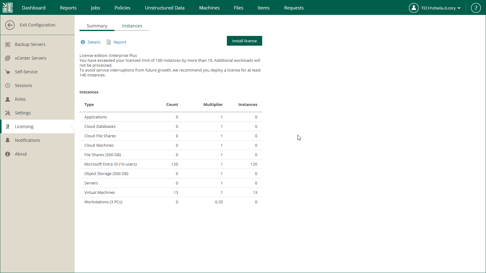

# Installing License

When you first log in to Veeam Backup Enterprise Manager after the deployment, you must install a license. The license will be automatically applied to all backup servers added to Enterprise Manager. This approach simplifies tracking license usage and license updates across multiple backup servers.

Before you install a license, read the considerations and limitations.

To install a license, take the following steps:

1. Sign in to Veeam Backup Enterprise Manager using an account with the Portal Administrator role.
2. To open the Configuration view, click Configuration in the upper-right corner.
3. In the Configuration view, open the Licensing section.
4. On the Summary tab, click Install license.
5. Select the necessary LIC file and click Open.

