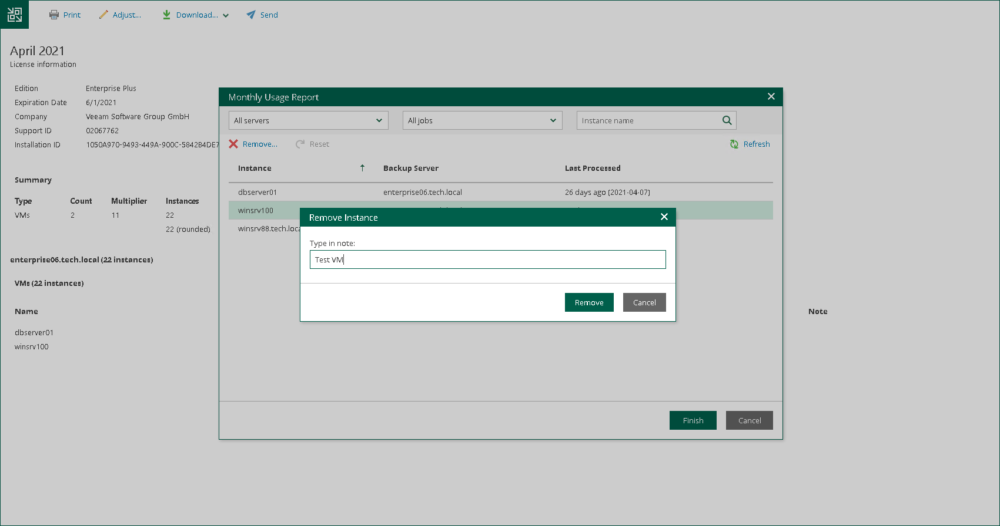

# Adjusting Monthly Usage Report

You can remove specific machines from a monthly usage report. For every removed machine, you must specify a reason.

To adjust a report:

1. In the monthly usage report notification, click the submit link.
2. In the Monthly Usage Report window, click Review.
3. On the report page, click Adjust.
4. In the list of machines, select the machine that you want to remove from the report and click Remove.

By default, the list of machines contains all managed machines included in the report. To quickly find the necessary machine, you can use the search field at the top of the window. You can also select a backup server and job from the drop-down lists to view a list of machines added to a specific job on a specific backup server.

1. In the Remove Instance window, in the Type in note field, provide a reason for removing the machine from the report.
2. Click OK, then click Finish. The change will be reflected in the report.

|  |
| --- |
| Tip |
| To reset changes introduced in the report, in the Monthly Usage Report window, click Reset. |

