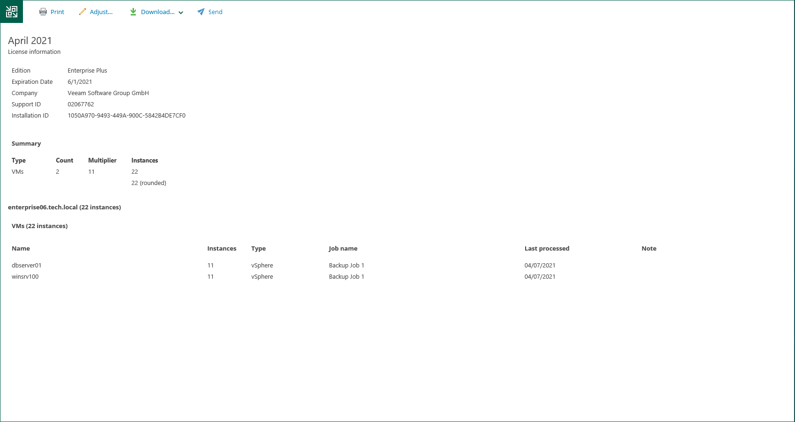

In this article

You can review a monthly usage report before sending it to Veeam.

To review a report:

1. In the monthly usage report notification, click the submit link.
2. In the Monthly Usage Report window, click Review.
3. In the monthly usage report, check the number of reported instances. The report contains the following data:

* License information: Veeam Backup & Replication edition, license expiration date, name of the company to which the license was issued and support ID.
* The number of instances used by each type of protected workloads (VMs, workstations, servers and file shares) and the total number of used instances.
* For each type of protected workloads, the report displays information about processed workloads and jobs that process these workloads.
* For each type of protected workloads, the report also displays the number of new objects that are not included in the report.

On the report page, you can perform the following actions:

* Print the report
* [Adjust the number of processed VMs in the report](em_license_usage_adjust.md)
* [Download the report](em_license_usage_save.md)
* [For automatic reporting] [Submit the report](em_license_usage_submit.md)

Page updated 9/2/2025

Page content applies to build 13.0.1.1071
