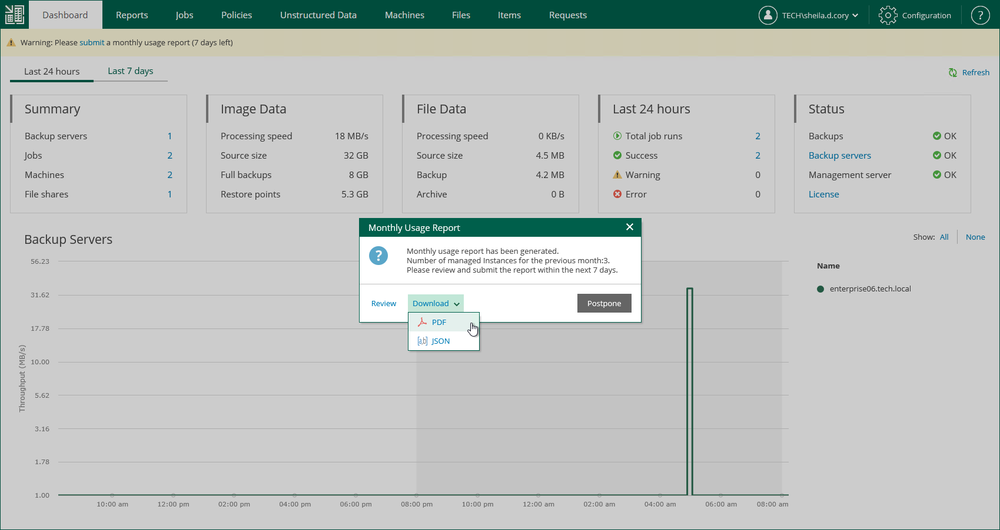

# Downloading Monthly Usage Report

You can download a monthly usage report as a PDF or JSON file.

To download a monthly usage report:

1. In the monthly usage report notification, click the submit link.
2. Download the report. The procedure differs depending on the reporting method. For more information, see the [License Usage Reporting](https://helpcenter.veeam.com/docs/vbr/cloud/sp_license_usage_report.html?ver=13) section of the Veeam Cloud Connect Guide.

* In case of automatic reporting, do the following:

1. In the Monthly Usage Report window, click Review.
2. On the report page, click Download and select the report format: PDF or JSON.

* In case of manual reporting, in the Monthly Usage Report window, click Download and select the report format: PDF or JSON.

You can also download the report after review. To do this, take the same steps as in case of automatic reporting.

