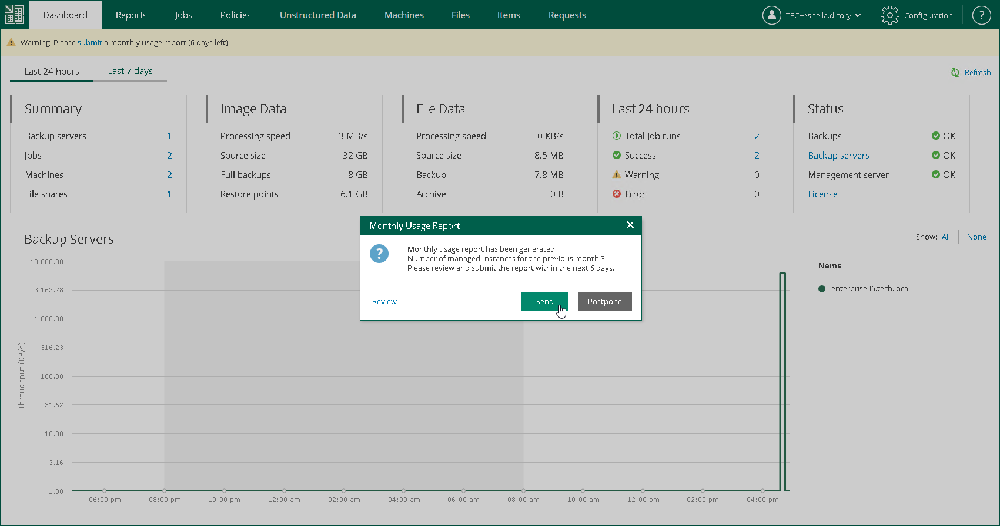

In this article

On the first day of the month, Veeam Backup Enterprise Manager shows a warning on the Dashboard tab. The warning prompts to submit a monthly usage report and informs on the number of days within which the report must be submitted.

You can submit a monthly usage report in one of the following ways:

* [Automatically](#automatically)
* [Manually](#manually)

For more information about how license usage reporting works, see the [License Usage Reporting](https://helpcenter.veeam.com/docs/vbr/cloud/sp_license_usage_report.html?ver=13) section of the Veeam Cloud Connect Guide.

Submitting Report Automatically

Automatic report submission allows you to send the report to Veeam directly from Veeam Backup Enterprise Manager. If you do not submit the report within 10 days, Veeam Backup Enterprise Manager sends the report on the eleventh day of the month.

To submit a monthly usage report automatically:

1. In the monthly usage report notification, click the submit link.
2. In the Monthly Usage Report window, to check or change the number of used instances, click Review.

For more information, see [Reviewing Monthly Usage Report](em_license_usage_review.md) and [Adjusting Monthly Usage Report](em_license_usage_adjust.md).

1. To submit the report, click Send.

You can also postpone the report submission. To do this, click Postpone. In this case, Veeam Backup Enterprise Manager closes the Monthly Usage Report window. Until the report is sent to Veeam, on the Dashboard tab, Enterprise Manager keeps displaying a warning prompting to submit the report.

Submitting Report Manually

You must send the report before the day defined by the agreement with Veeam or your Aggregator (if any is involved). The default day is the tenth day of the month.

To submit a monthly usage report manually:

1. In the monthly usage report notification, click the submit link.
2. In the Monthly Usage Report window, to check or change the number of used instances, click Review. For more information, see [Reviewing Monthly Usage Report](em_license_usage_review.md) and [Adjusting Monthly Usage Report](em_license_usage_adjust.md).
3. To download the report, click Download.

You can also postpone the report submission. To do this, click Postpone. In this case, Veeam Backup Enterprise Manager closes the Monthly Usage Report window. Until the report is sent to Veeam, on the Dashboard tab, Enterprise Manager keeps displaying a warning prompting to submit the report.

1. Send the downloaded report to Veeam.

Page updated 10/30/2025

Page content applies to build 13.0.1.1071
