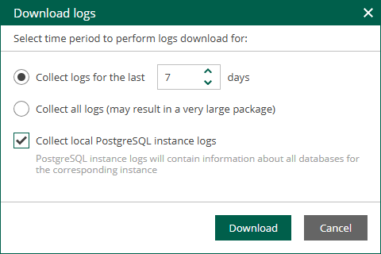

In this article

Veeam Backup Enterprise Manager provides detailed logging of performed activities, data protection and disaster recovery tasks. You can use Enterprise Manager logs to submit a support ticket at the [Veeam Customer Support Portal](https://www.veeam.com/support.html).

Downloading Enterprise Manager Logs

To ensure that Veeam Customer Support receives complete diagnostic information, include all log files when submitting a support ticket.

|  |
| --- |
| Note |
| If you use Enterprise Manager on Linux, you can download the entire Veeam Software Appliance log bundle using Veeam Host Management. For details, see [Performing Maintenance Tasks](hmc_perform_maintenance_tasks.md). |

To download all Enterprise Manager logs, perform the following steps:

1. Log in to Enterprise Manager using an administrative account.
2. To open the Configuration view, click Configuration in the upper-right corner.
3. Open the About section on the left of the Configuration view.
4. Click Download support logs.
5. Choose the time interval for which logs must be collected. You can select one of the following options:

* Collect logs for the last N days
* Collect all available logs

1. [Optional] Select Collect local PostgreSQL instance logs to include logs from the Enterprise Manager configuration database stored in a local PostgreSQL instance. The logs will contain information about all databases contained on the selected instance.

The option is not available if the Enterprise Manager configuration database is located remotely or if the database is based on the Microsoft SQL Server engine.

Log Files Location

Log files are stored on the Enterprise Manager server in the following locations:

* Linux-based Enterprise Manager (Veeam Software Appliance):

* Enterprise Manager logs:

|  |
| --- |
| /var/log/VeeamBackup |

* Nginx logs for the Enterprise Manager web application.

|  |
| --- |
| /var/log/nginx |

* Veeam Host Management logs:

|  |
| --- |
| /var/log/veeam/veeam\_hostmanager |

* Veeam Updater logs:

|  |
| --- |
| /var/log/veeam/veeam-updater |

* Microsoft Windows-based Enterprise Manager:

|  |
| --- |
| C:\ProgramData\Veeam\Backup |

Enterprise Manager components generate the following primary log files. For more information on the components, see [Enterprise Manager Components](em_components.md).

| Logs | Description | Linux | Microsoft Windows |
| --- | --- | --- | --- |
| Svc.Identity.EM.log | Veeam Enterprise Manager Identity Service logs. | ✔ | ✔ |
| Svc.VeeamBES.log | Main Veeam Backup Enterprise Manager Service logs. | ✔ | ✔ |
| Svc.VeeamBES.Collect.log | Veeam Backup Enterprise Manager Service log for data collection. | ✔ | ✔ |
| Svc.VeeamCatalog.log | Main Veeam Catalog Service logs. | ✔ | ✔ |
| Svc.Veeam.EM.RestAPI.log | Veeam Backup Enterprise Manager REST API logs. | ✔ | ✔ |
| Veeam.RemotePlugin.log | Veeam Plug-in for VMware vSphere Client Service logs. | ✔ | ✔ |
| Veeam.WebApp.log | Veeam Backup Enterprise Manager web application logs. | ✔ | ✔ |
| /var/log/nginx | Nginx logs for the Veeam Backup Enterprise Manager web application. | ✔ | ✖ |
| /var/log/veeam/veeam\_hostmanager | Veeam Host Management logs. | ✔ | ✖ |
| /var/log/veeam/veeam-updater | Veeam Updater logs. | ✔ | ✖ |

Page updated 11/14/2025

Page content applies to build 13.0.1.1071
