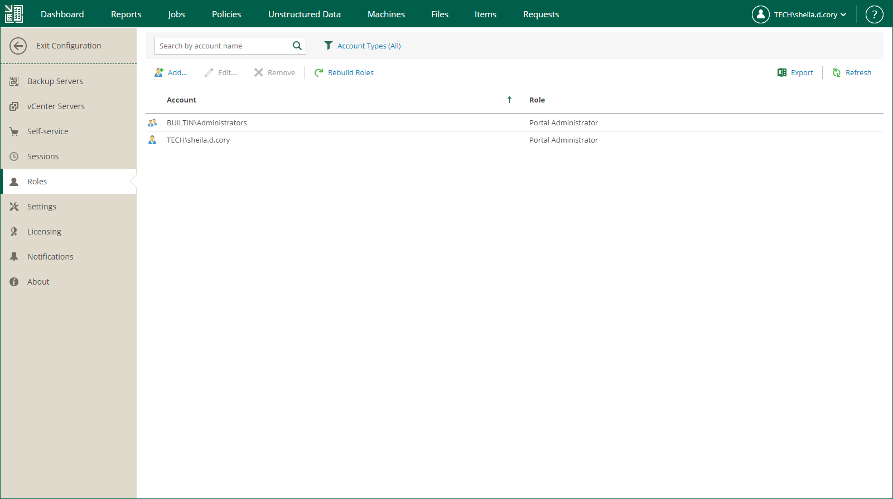
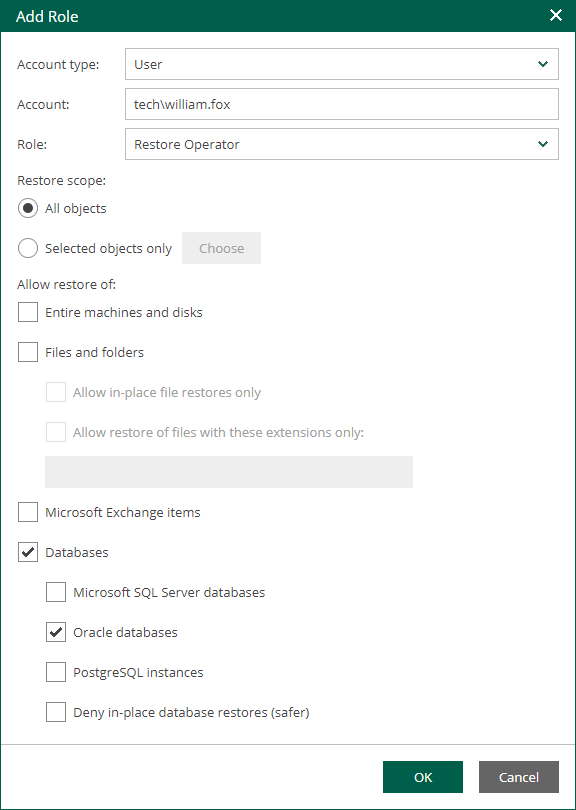

In this article

Users with the Portal Administrator role can perform the following actions with accounts:

* [Add account](#add)
* [Edit account](#edit)
* [Remove account](#remove)

When you add or edit an account, you can configure permissions for restore operations that the user can perform. The permissions are defined by restore scope and restore type. For more information, see the following sections:

* [Configuring Restore Scope](veeam_backup_em_restore_scope.md)
* [Configuring Permissions for File and Application Item Restore](configuring_restrictions_for_restore.md)

If you have Veeam ONE deployed in your backup infrastructure, you can view a report that lists Enterprise Manager users, their roles and restore permissions. For details, see the [Delegated Restore Permissions Overview](https://helpcenter.veeam.com/docs/one/userguide/delegated_restore_permissions.html?ver=13) section of the Veeam ONE Reporting Guide.

Adding Account

To add an account, take the following steps:

1. Log in to Enterprise Manager using an administrative account.
2. To open the Configuration view, click Configuration in the upper-right corner.
3. Select the Roles section on the left of the Configuration view.

1. Click Add on the toolbar.
2. From the Account type list, select a type of the account: User, Group, External User or External Group. For more information, see [Accounts and Roles Overview](em_about_accounts_and_roles.md#acc_types).
3. In the Account field, specify an account name in the DOMAIN\Username or Username@Suffix format depending on the account type. For more information, see [Accounts and Roles Overview](em_about_accounts_and_roles.md#acc_types).
4. From the Role list, select a role you want to assign to the account: Portal Administrator, Portal User or Restore Operator. For more information, see [Accounts and Roles Overview](em_about_accounts_and_roles.md#roles).

|  |
| --- |
| Note |
| To be able to assign any of portal roles to Active Directory domain users or groups, make sure that Veeam Backup Enterprise Manager service account has sufficient rights to enumerate Active Directory domains (by default, Active Directory users have enough rights to enumerate Active Directory domains). |

1. [For Portal User or Restore Operator] In the Restore scope section, you can allow a user to restore all objects (machines and file shares) processed by managed backup servers or the selected objects only. For more information, see [Configuring Restore Scope](veeam_backup_em_restore_scope.md).

In the Allow restore of section, you can configure additional restrictions for the restore scope. For more information, see [Configuring Permissions for File and Application Item Restore](configuring_restrictions_for_restore.md).

Editing Account

To edit settings of an added user or group, select it in the list of roles and click Edit on the toolbar. Then edit user or group settings as required.

Removing Account

To remove an added user or group, select it in the list and click Remove on the toolbar.

Page updated 10/30/2025

Page content applies to build 13.0.1.1071
