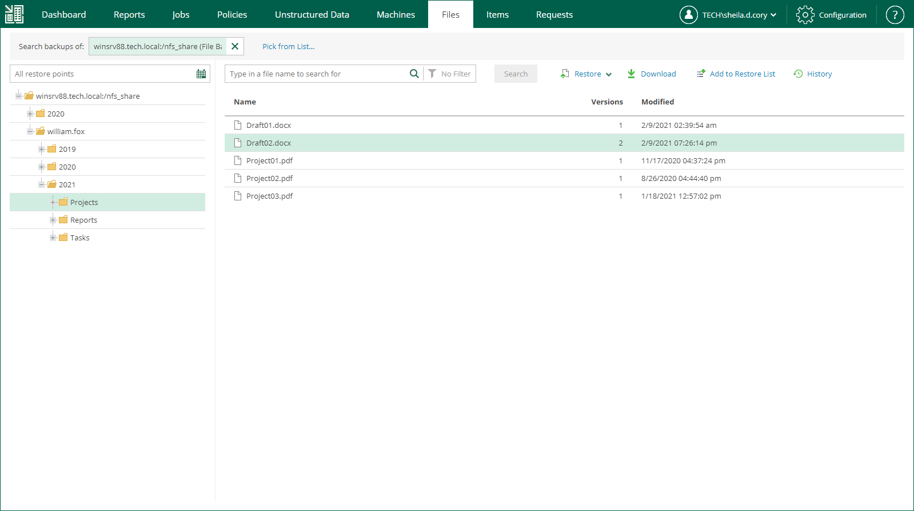
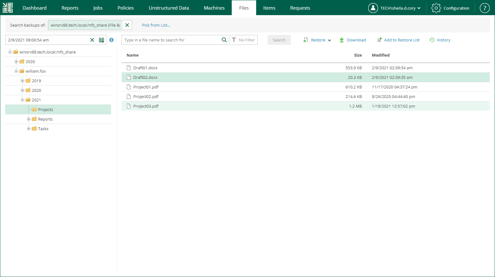

In this article

You can browse the content of file shares and object storage systems for specific items in the selected backup.

To browse the content of a data source, do the following:

1. On the Unstructured Data tab, select a data source and click Restore.

Alternatively, on the Files tab, in the Search backups of field, enter the name of a data source whose items you want to browse or click the Pick from List link and select a data source in the Select Object window. Then click Mount.

1. Wait while Veeam Backup & Replication mounts the content from backup to a backup server. When the process is completed, Veeam Backup Enterprise Manager displays the content of the data source.
2. You can browse files contained in all restore points created by the backup job or in a specific restore point.

* By default, the All restore points option is selected. With this option selected, you can browse the content in all restore points created by the backup job.

For each object in the backup, Enterprise Manager displays the number of object versions and the date when the latest version was created. If an object has more than one version, you can select a necessary version during the restore process. For more information, see [Restoring Specific Files](em_managing_file_shares_restore.md).

* To select a specific restore point, click the calendar icon in the restore point field and select the necessary backup date and a restore point created on that date. Note that you cannot select a date on which the backup was not performed.

For each file in the backup, Enterprise Manager displays file size and the date when the file version is created. Enterprise Manager displays only the file version contained in the selected restore point. For more information on file restore, see [Restoring Specific Files](em_managing_file_shares_restore.md).

|  |
| --- |
| Tip |
| You can use the search field at the top of the working area to search for specific files and folders. Depending on the number of files in the file share, the search process may take some time. For more information, see [Searching for Items in Unstructured Data Backups](unstructured_data_searching_for_items.md). |

Page updated 12/10/2024

Page content applies to build 13.0.1.1071
