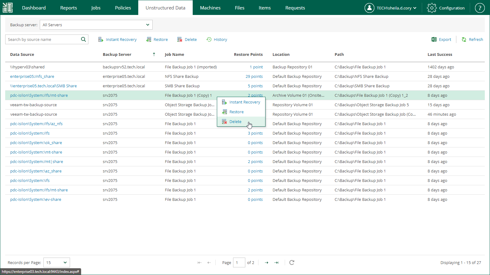

In this article

You can delete the data of a file share or object storage from a backup repository. The deleted data source is not removed from the list immediately. It will be removed from the list after the records about the data source are removed from the configuration database of the backup server. Once this operation completes, a notification will appear at the top of the Enterprise Manager window.

If four-eyes authorization is enabled on the backup server, backup files will remain in the backup repository and become orphaned.

To delete a backup, do the following:

1. Open the Unstructured Data tab.
2. In the list of backups, select the necessary backup and click Delete.

To locate the necessary backup, you can filter backups by backup server name or search by data source name.

1. In the displayed window, click Yes.

|  |
| --- |
| Note |
| If several data sources are processed by the same backup job, deletion of the selected data source backup will not affect other data sources in the job. |

Page updated 5/21/2024

Page content applies to build 13.0.1.1071
