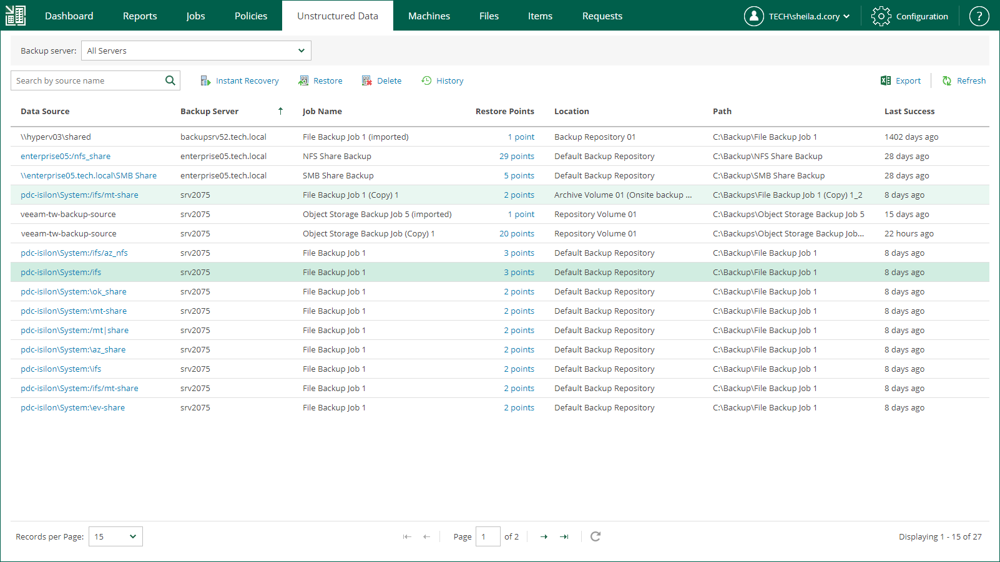
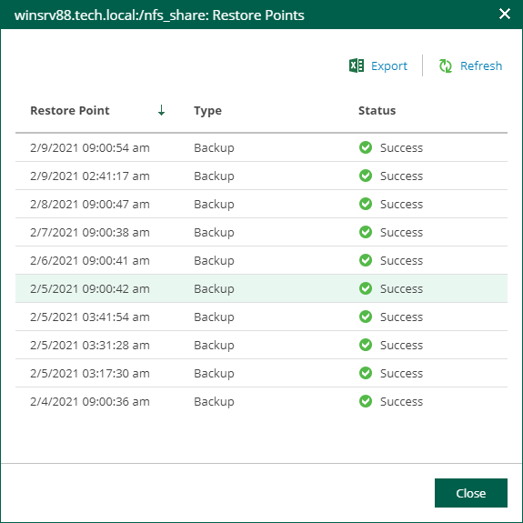

# Viewing Unstructured Data Backups

From Veeam Backup Enterprise Manager, you can view information about unstructured data (file shares and object storage systems) processed by backup jobs configured on added backup servers. You can view backed up unstructured data on the Unstructured Data tab.

Each entry in the unstructured data list contains the following information:

* Data Source — file share or object storage
* Backup Server — backup server that processes the data source
* Job Name — backup job that backs up the data source
* Restore Points — number of created restore points
* Location — name of the backup repository where the restore points are stored
* Path — path to the backup files
* Last success — time the job last ran successfully

To quickly find a data source (file share or object storage), you can filter the list of data sources by backup server or data source.

* To filter data sources by backup server name, from the Backup server list, select the necessary backup server. Veeam Backup Enterprise Manager will display backups of only those file data sources that are processed by the selected backup server.

The Backup server filter is only available for users with the Portal Administrator or Portal User role.

* To filter data sources by source name, enter the name or a part of the name in the search field. Veeam Backup Enterprise Manager will display backups of only those data sources whose names match the text that you entered.

|  |
| --- |
| Note |
| To export displayed information to a file, use the Export link on the toolbar. |

You can also view additional data about each data source:

* To see detailed information about a data source, click its name in the Data Source column.
* To see detailed information about restore points, click a link in the Restore Points column.

