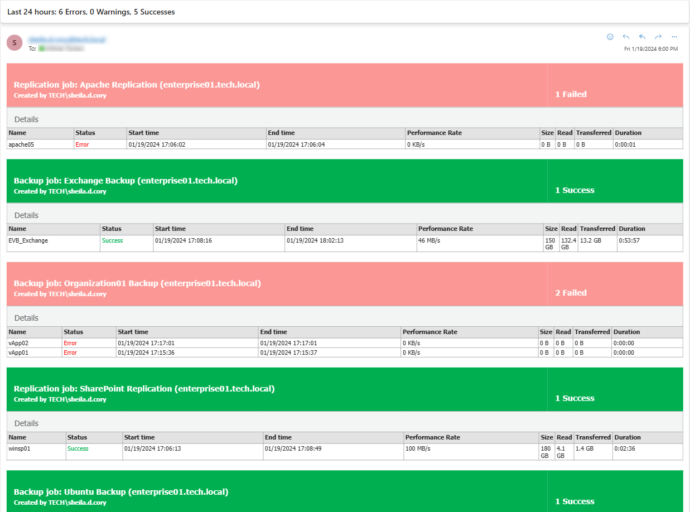
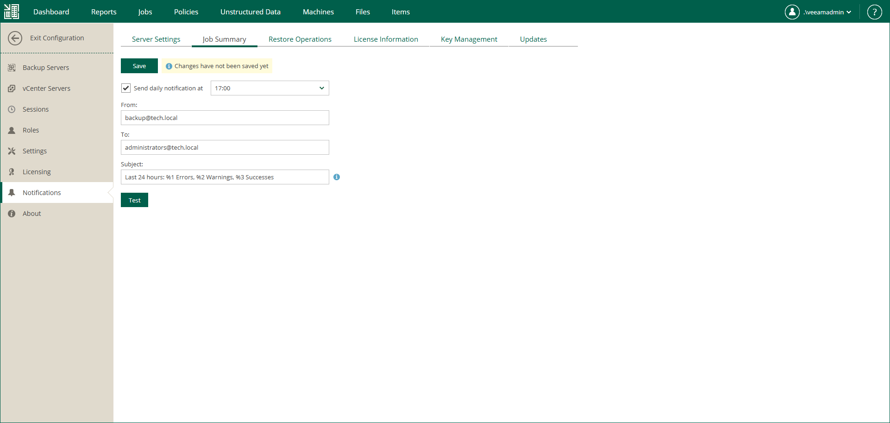

In this article

You can configure Veeam Backup Enterprise Manager to send daily email notifications with the results of finished jobs. The email message contains a detailed list of jobs performed with the Error, Warning and Success statuses. If you want to receive a notification after each job run, configure notification setting for this job in Veeam Backup & Replication. For details, see the [Notification Settings](https://helpcenter.veeam.com/docs/vbr/userguide/backup_job_advanced_notify_vm.html?ver=13) section of the Veeam Backup & Replication User Guide.

The report includes the following job types:

* Backup jobs
* Replication jobs
* File backup jobs
* Object storage backup jobs
* Backup jobs of Veeam Agent for Linux and Veeam Agent for Microsoft Windows (both managed by Veeam Agent and by the backup server)

To receive daily email notifications about job results, do the following:

1. Log in to Enterprise Manager using an administrative account.
2. To open the Configuration view, click Configuration in the upper-right corner.
3. Open the Notifications section on the left of the Configuration view.
4. Open the Job Summary tab.
5. Select the Send daily notification at check box and specify the time when you want a notification email to be sent.
6. In the From field, enter an email address of the notification sender.
7. In the To field, enter an email address of the notification recipient. Use a comma to specify multiple addresses.
8. In the Subject field, enter a subject of email notifications. You can use the following variables in the subject:

* %1 — number of jobs that ended with errors for the last 24 hours
* %2 — number of jobs that ended with warnings for the last 24 hours
* %3 — number of jobs that ended successfully for the last 24 hours

Job retries performed in the last 24 hours are also included in the report.

* %4 — number of jobs whose last session ended with an error.
* %5 — number of jobs whose last session ended with a warning.
* %6 — number of jobs whose last session ended successfully.

Jobs which were in Disabled state during the last session are also included in the report.

1. Click Save.

|  |
| --- |
| Tip |
| To verify that you have configured email settings correctly, click Test. Veeam Backup Enterprise Manager will send a test email to all specified email addresses. |

Page updated 11/10/2025

Page content applies to build 13.0.1.1071
