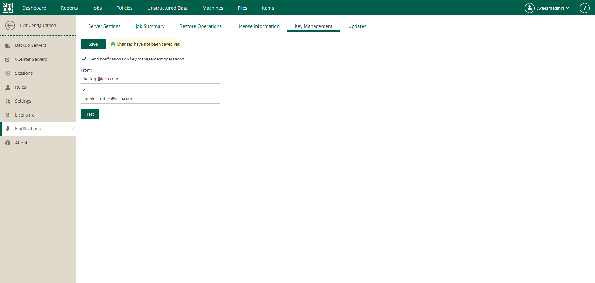

In this article

Veeam Backup Enterprise Manager allows you to perform operations with encryption keys. For more information, see [Managing Encryption Keys](em_manage_keys.md).

You can configure Enterprise Manager to send notifications about the following key management operations: key expiration, key deletion, key modification.

To receive key management notifications, do the following:

1. Log in to Enterprise Manager using an administrative account.
2. To open the Configuration view, click Configuration in the upper-right corner.
3. Open the Notifications section on the left of the Configuration view.
4. Open the Key Management tab.
5. Select the Send notifications on key management operations check box.
6. In the From field, enter an email address of the notification sender.
7. In the To field, enter an email address of the notification recipient. Use a comma to specify multiple addresses.
8. Click Save.

|  |
| --- |
| Tip |
| To verify that you have configured email settings correctly, click Test. Veeam Backup Enterprise Manager will send a test email to all specified email addresses. |

Page updated 11/10/2025

Page content applies to build 13.0.1.1071
