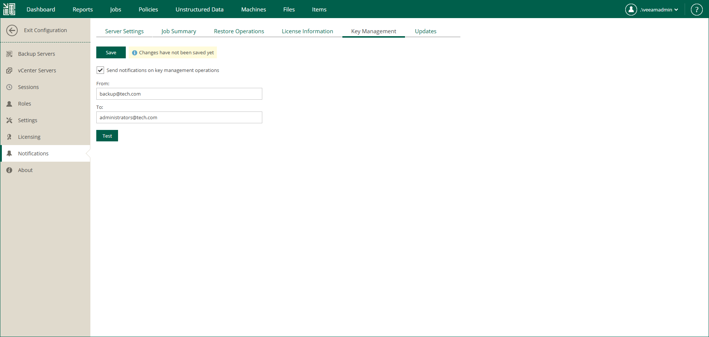

# Notifications on Key Management

Veeam Backup Enterprise Manager allows you to perform operations with encryption keys. For more information, see [Managing Encryption Keys](em_manage_keys.md).

You can configure Enterprise Manager to send notifications about the following key management operations: key expiration, key deletion, key modification.

To receive key management notifications, do the following:

1. Log in to Enterprise Manager using an account with the Portal Administrator role.
2. In the upper-right corner, click Configuration.
3. In the Configuration view, open the Notifications section.
4. Open the Key Management tab.
5. Select the Send notifications on key management operations check box.
6. In the From field, enter an email address of the notification sender.
7. In the To field, enter an email address of the notification recipient. Use a comma to specify multiple addresses.
8. Click Save.

|  |
| --- |
| Tip |
| To verify that you have configured email settings correctly, click Test. Veeam Backup Enterprise Manager will send a test email to all specified email addresses. |

Page updated 2026-07-21

