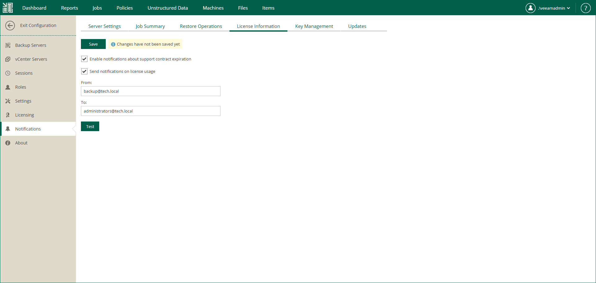

# Notifications on Licensing

You can configure Veeam Backup Enterprise Manager to send the following email notifications:

* [For Perpetual licenses] [Notifications on support contract expiration](#support)
* [For Rental licenses] [Notifications on license usage](#usage)

Notifications on Support Contract Expiration

If you have a Perpetual license installed and your support contract is expired, Veeam Backup Enterprise Manager adds the SUPPORT EXPIRED prefix to the subject of all its email messages. You can configure Enterprise Manager to remove the prefix.

To remove the SUPPORT EXPIRED prefix from the message subject:

1. Log in to Enterprise Manager using an administrative account.
2. To open the Configuration view, click Configuration in the upper-right corner.
3. Open the Notifications section on the left of the Configuration view.
4. Open the License Information tab.
5. Select the Disable support contract expiration notifications check box.

Notifications on License Usage

If you have a Rental license installed, you can configure Veeam Backup Enterprise Manager to send email notifications on license usage. Every notification contains a monthly usage report about instances used for backup and replication in the previous month. For more information on the reports, see [Managing Monthly Usage Reports](em_license_usage_manage.md).

Enterprise Manager sends notifications on license usage on the first day of the month. If Veeam Backup & Replication does not perform any backup and replication jobs for the whole month, Enterprise Manager does not send the notifications.

To enable email notifications on license usage:

1. Log in to Enterprise Manager using an administrative account.
2. To open the Configuration view, click Configuration in the upper-right corner.
3. Open the Notifications section on the left of the Configuration view.
4. Open the License Information tab.
5. Select the Send notifications on license usage check box.
6. In the From field, enter an email address of the notification sender.
7. In the To field, enter an email address of the notification recipient. Use a comma to specify multiple addresses.
8. Click Save.

|  |
| --- |
| Tip |
| To verify that you have configured email settings correctly, click Test. Veeam Backup Enterprise Manager will send a test email message to all specified email addresses. |

