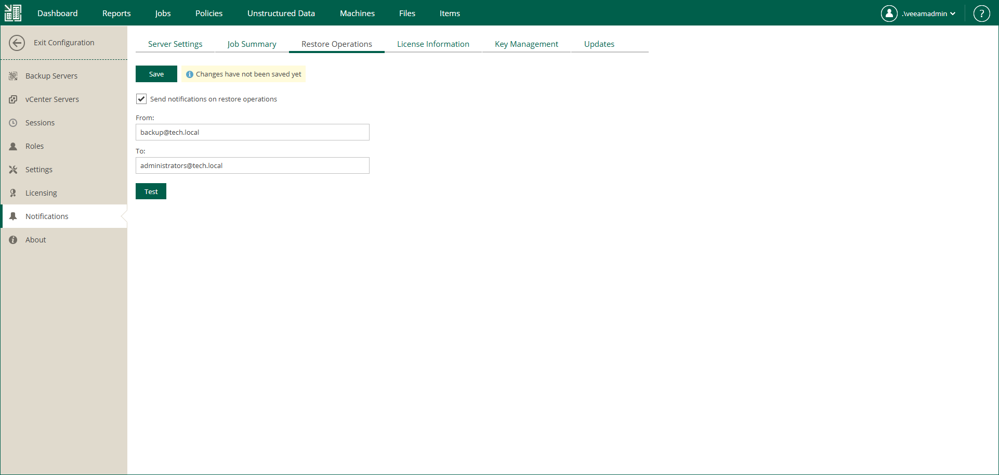

# Notifications on Restore Operations

You can configure Veeam Backup Enterprise Manager to send email notifications about the following recovery operations:

* [Instant Recovery](instant_recovery.md)
* [Entire VM Restore](entire_vm_restore.md)
* [Guest OS file restore](searching_restoring_vm_guest_files.md)
* [Instant File Share Recovery](instant_nas_recovery.md)
* [Application Item Restore](em_backup_restore_app_items.md)

To receive notifications about performed file restore operations, do the following:

1. Log in to Enterprise Manager using an administrative account.
2. To open the Configuration view, click Configuration in the upper-right corner.
3. Open the Notifications section on the left of the Configuration view.
4. Open the Restore Operations tab.
5. Select Send notifications on restore operations.
6. In the From field, enter an email address of the notification sender.
7. In the To field, enter an email address of the notification recipient. Use a comma to specify multiple addresses.
8. Click Save.

|  |
| --- |
| Tip |
| To verify that you have configured email settings correctly, click Test. Veeam Backup Enterprise Manager will send a test email to all specified email addresses. |

