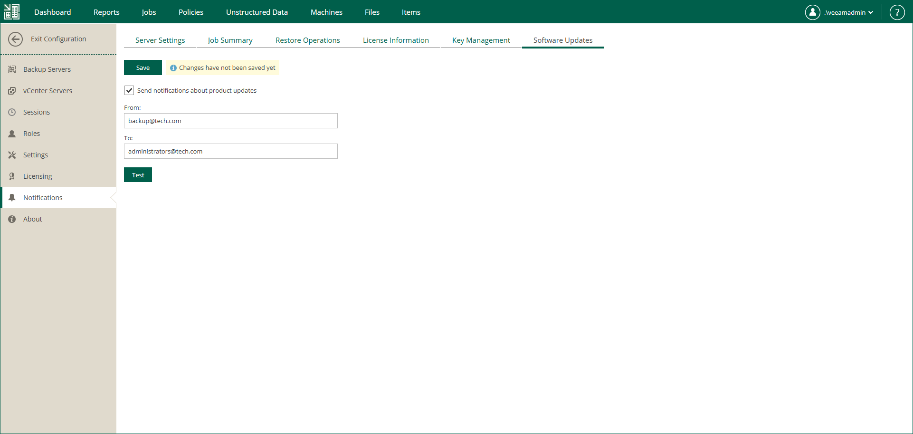

In this article

If you use Veeam Backup Enterprise Manager on Linux, you can configure Enterprise Manager to send email notifications when product updates become available.

To enable email notifications for Enterprise Manager updates, follow these steps:

1. Log in to Enterprise Manager using an administrative account.
2. To open the Configuration view, click Configuration in the upper-right corner.
3. Open the Notifications section on the left of the Configuration view.
4. Open the Software Updates tab.
5. Select the Send notifications about product updates check box.
6. In the From field, enter an email address of the notification sender.
7. In the To field, enter an email address of the notification recipient. Use a comma to specify multiple addresses.
8. Click Save.

|  |
| --- |
| Tip |
| To verify that you have configured email settings correctly, click Test. Veeam Backup Enterprise Manager will send a test email message to all specified email addresses. |

Page updated 11/5/2025

Page content applies to build 13.0.1.1071
