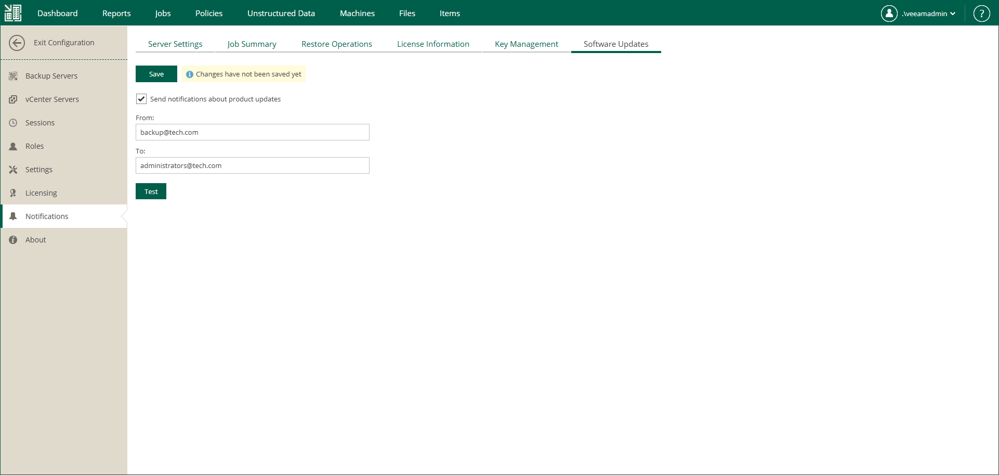

# Notifications on Updates

If you use Veeam Backup Enterprise Manager on Linux, you can configure Enterprise Manager to send email notifications when product updates become available.

To enable email notifications for Enterprise Manager updates, follow these steps:

1. Log in to Enterprise Manager using an account with the Portal Administrator role.
2. In the upper-right corner, click Configuration.
3. In the Configuration view, open the Notifications section.
4. Open the Software Updates tab.
5. Select the Send notifications about product updates at check box and specify the time when you want a notification email to be sent.
6. In the From field, enter an email address of the notification sender.
7. In the To field, enter an email address of the notification recipient. Use a comma to specify multiple addresses.
8. Click Save.

|  |
| --- |
| Tip |
| To verify that you have configured email settings correctly, click Test. Veeam Backup Enterprise Manager will send a test email message to all specified email addresses. |

Page updated 2026-07-21

