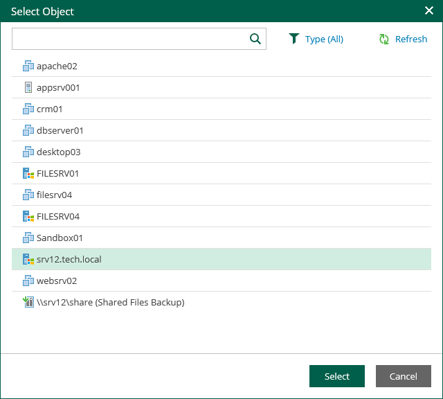

# Browsing and Restore Procedures

To browse guest OS files in a physical server backup:

1. In the Enterprise Manager main window, click the Files tab.
2. Select a necessary server. You can type in a server name or pick it from the list. Note that server icons indicate server OSes.

1. If the server is backed up without guest indexing, click Mount Backup and wait for the process to complete.
2. In the Restore point field in the upper-left corner of the Files tab, select a necessary date of backup and a restore point. Note that the dates when backup of the selected server was performed are highlighted in the calendar.
3. To search for a file, take the steps similar to the [Searching for Guest OS Files in Machine Backups](searching_vm_backups.md) procedure.
4. To restore a file, take the steps similar to the [Performing 1-Click File Restore](performing_1-click_file_restore.md) procedure.

|  |
| --- |
| Note |
| File restore from backups of Veeam Agent for Mac, Veeam Agent for Oracle Solaris and Veeam Agent for IBM AIX to the original location is not available. |

|  |
| --- |
| Important |
| When restoring files to the original location, you are prompted for user credentials to the target machine. Make sure the account you provide has sufficient access rights. |

