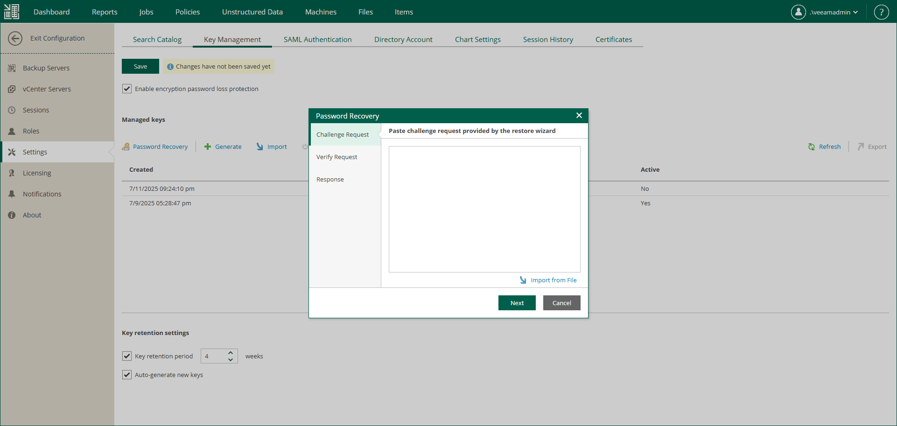

In this article

When an encrypted backup file or tape media is imported on a backup server, a user key with password or a KMS server key is required to decrypt the data. However, the password can be lost or forgotten, or the KMS server may not be available. Veeam Backup Enterprise Manager lets decrypt such backups.

To decrypt your data, use the Password Recovery wizard within the following context:

1. In Veeam Backup & Replication, you generate a request message for password restore. For more information, see the [Create Request for Data Restore section](https://helpcenter.veeam.com/docs/vbr/userguide/restore_without_pass_request.html?ver=13) of the Veeam Backup & Replication User Guide.
2. In Veeam Backup Enterprise Manager, you start the Password Recovery wizard by clicking the Password Recovery button in Configuration > Key Management, and insert the text of the request to the wizard.

1. Veeam Backup Enterprise Manager finds a matching public backup server key in Veeam Backup Enterprise Manager database and decrypts the signature with this key.
2. The wizard decrypts storage keys with the private Enterprise Manager key available on Veeam Backup Enterprise Manager, and generates a response. The response represents a text document and contains decrypted storage keys. Consider that the response is also encrypted and can be used only on the backup server where the request was issued.
3. Then you can send the response back to requester, for example, by email. The requester will input this response to the Enterprise Keys Restore wizard on the Veeam backup server where the request was issued; Veeam Backup & Replication will process the response, retrieve the decrypted storage keys and use them to unlock encrypted backups or tapes and retrieve their content.

|  |
| --- |
| Important |
| In case your organization encrypts configuration backups of a backup server, and you want to be able to serve password restore request for these backups, ensure the original backup server and its public key (used for configuration backup encryption) are present on the Enterprise Manager server by the moment you receive such a request. Consider the following:   * If a backup server is removed from Enterprise Manager, its public key will be deleted from the Enterprise Manager database. * If a new configuration database is created on a backup server, then a new public key will be automatically generated for that backup server on Enterprise Manager, replacing its existing key. |

For details on Enterprise Manager keysets, encryption passwords and password restore, see the [Data Encryption](https://helpcenter.veeam.com/docs/vbr/userguide/data_encryption.html?ver=13) section of the Veeam Explorers User Guide.

Page updated 11/10/2025

Page content applies to build 13.0.1.1071
