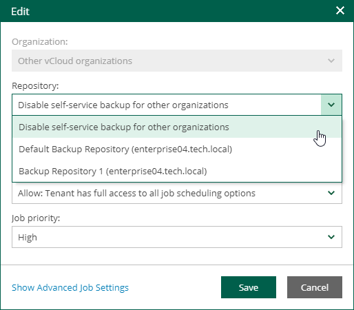

In this article

Users with the Portal Administrator role can remove VMware Cloud Director organization configurations.

After you remove a configuration, the backup files created by existing backup jobs will remain in the backup repository. The backup jobs associated with this configuration will also remain but will fail to run because the backup repository will not be available to the organization. If you add a new configuration with the same backup repository for this organization, the organization's backup jobs will continue existing backup chains.

If you want to replace an organization configuration with the one that uses a different backup repository and and you want to keep all created backup chains, create the new configuration first, move backups to the new repository, and then remove the unnecessary organization configuration. For details, see [About Organization Quota](vcd_organization_quota.md).

To remove an organization configuration, do the following:

1. Log in to Veeam Backup Enterprise Manager using an administrative account.
2. Click Configuration in the upper-right corner.
3. In the Configuration view, select the Self-service section.
4. In the Self-service section, select the Cloud Director tab.
5. On the Cloud Director tab, select a configuration and click Remove.
6. To confirm the removal, click Yes.

Disabling Default Configuration

The default configuration cannot be removed from the list — instead, you can disable it.

To disable the default configuration:

1. Log in to Veeam Backup Enterprise Manager using an administrative account.
2. Click Configuration in the upper-right corner.
3. In the Configuration view, select the Self-service section.
4. In the Self-service section, select the Cloud Director tab.
5. On the Cloud Director tab, select the default organization configuration and click Edit.
6. From the Repository drop-down list, select Disable self-service backup for other organizations.

Page updated 10/30/2025

Page content applies to build 13.0.1.1071
