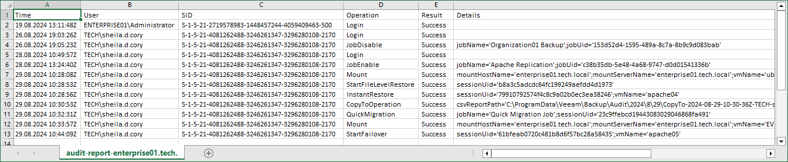
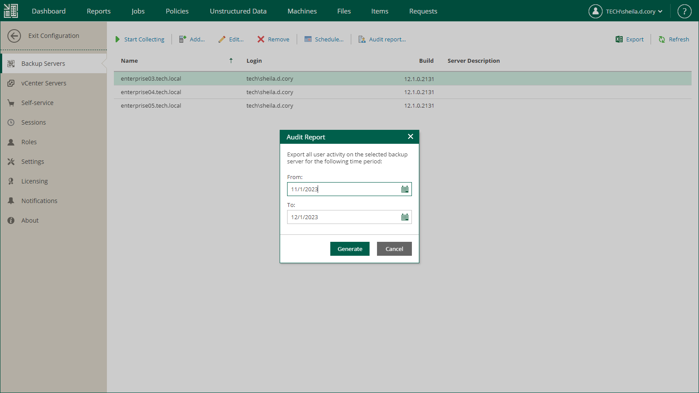

In this article

Audit reports contain records of user activity performed on the selected backup server for the specified period. Users with the Portal Administrator role can generate audit reports for backup servers added to the Veeam Backup Enterprise Manager infrastructure. For more information, see [Generating Audit Report](#generate).

Audit Report Overview

Audit reports include the following details about user activity:

* Date and time when a user performed an operation
* User name
* User security identifier (SID)
* Name of the operation initiated by the user

For more information on operations included in the report, see [Audited Operations](audited_operations.md).

* Operation result
* Details on the performed operation

Generating Audit Report

When you generate an audit report, it is downloaded in the CSV format to the local machine.

The generated file is also saved on the Enterprise Manager machine. Enterprise Manager does not clean up these files. You can find all reports in the following folder: %ProgramData%\Veeam\Backup\WebRestore.

To generate an audit report:

1. Log in to Enterprise Manager using an administrative account.
2. To open the Configuration view, click Configuration in the upper-right corner.
3. Select the Backup Servers section on the left of the Configuration view.
4. Select a backup server whose report you want to export.
5. Click Audit report.
6. In the Audit Report window, specify a time period covered by the report and click Generate.

The report contains only the audit records whose retention period is not expired. The retention period is defined by the Event history setting of Enterprise Manager. For more information on retention settings, see [Configuring Retention Settings for Index and History](configuring_retention_settings.md).

Page updated 10/30/2025

Page content applies to build 13.0.1.1071
