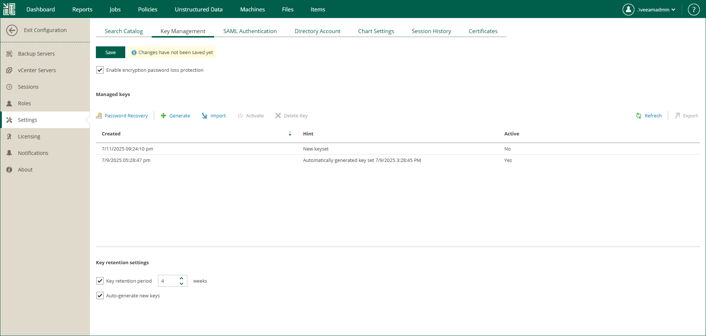

# Specifying Retention Settings for Enterprise Manager Keyset

Government regulations and internal company policies may require you to regularly change encryption keys. The shorter the lifetime of an encryption key, the less data is encrypted with this key, which results in a higher level of encryption security.

The lifetime of Enterprise Manager keys is determined by the key retention period. The key retention period specifies how long the keys must remain active and be used for encryption and decryption operations.

You can configure the retention period for Enterprise Manager keysets as follows:

1. In Veeam Backup Enterprise Manager, open the Settings section of the Configuration view.
2. On the Key Management tab, in the Managed keys section, select the necessary options:

* To set a retention period for Enterprise Manager keysets, select the Key retention period check box and specify the number of weeks for which Enterprise Manager keys must remain in effect (default is 4 weeks). When the retention period ends and key auto-generation is turned off, a user will receive a notification email and must manually create and activate a new keyset. After a new keyset is ready, the old keyset is marked as inactive.

* To enable automatic generation of new keysets, select the Auto-generate new keys check box. When the current keyset expires, Veeam Backup Enterprise Manager will automatically generate a new keyset and mark it as active. During the next data synchronization session, Veeam Backup Enterprise Manager propagates the new public Enterprise Manager key to all added backup servers. The private Enterprise Manager key remains on Veeam Backup Enterprise Manager and is used for data decryption.

1. Click Save to apply the settings.

