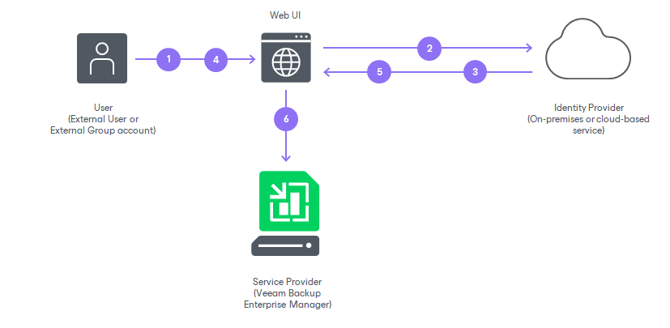

In this article

Veeam Backup Enterprise Manager supports single sign-on authentication based on the SAML 2.0 protocol. Enterprise organizations who use a single sign-on (SSO) service in their IT infrastructure can extend single sign-on capabilities to Veeam Backup Enterprise Manager. Once a user of the organization is logged in to the single sign-on service, the user can access Veeam Backup Enterprise Manager without the need to provide their credentials.

You can enable SSO for the following Veeam Backup Enterprise Manager components:

* [Veeam Backup Enterprise Manager website](accessing_management_website.md)
* [vSphere Self-Service Backup Portal](em_working_with_vsphere_vms.md)

SAML authentication scenario in Veeam Backup Enterprise Manager comprises the following parties:

* User that logs in to the Veeam Backup Enterprise Manager website or vSphere Self-Service Backup Portal.
* Service provider (SP) — an application accessed by the user. In the Veeam backup infrastructure, the service provider is the Veeam Backup Enterprise Manager website or vSphere Self-Service Backup Portal.
* Identity provider (IdP) — an external service (hosted on premises or in the public cloud) that facilitates SSO. The IdP keeps user identity data in a user store (or attribute store). Upon requests from the SP, the IdP issues SAML authentication assertions, that is, identifies the user and provides the SP with required information about the user.

Veeam Backup Enterprise Manager supports identity providers that support the SAML 2.0 protocol, for example, Active Directory Federation Services (AD FS), Azure Active Directory (Azure AD), Okta, Auth0, Keycloak and so on.

The SP and IdP exchange information in the XML format in accordance with the [SAML V2.0 Standard](https://wiki.oasis-open.org/security/FrontPage#SAML_V2.0_Standard). The Enterprise Manager administrator can specify what information is required from the IdP to set up SAML authentication in Enterprise Manager and how SAML requests and responses are sent.

How It Works

In Veeam Backup Enterprise Manager, SAML authentication is performed in the following way:

1. The user accesses the website under an account of the External type. The account must be registered in advance in Enterprise Manager by the Enterprise Manager administrator.
2. Veeam Backup Enterprise Manager redirects a SAML authentication request to the IdP.
3. If the user has not previously logged in with the single sign-on service of the IdP, the IdP redirects the user to the URL of the single sign-on webpage.

Alternatively, if the user is already logged in with the single sign-on service, the user proceeds directly to the step 6.

1. If the user has not previously logged in with the single sign-on service, the user specifies the password of their account on the single sign-on webpage.
2. The IdP issues a SAML assertion and redirects it to Veeam Backup Enterprise Manager in the SAML response. The SAML assertion must meet the following requirements:

* Contain a User Principal Name (UPN) of the user in the <NameID> element of the SAML response.
* Specify that the UPN type is Persistent.

1. The user gains access to the website and can perform operations according to the role and restore scope specified for the user account.

Getting Started

To set up SAML authentication, the Enterprise Manager administrator must complete the following tasks in Enterprise Manager:

1. Obtain SAML metadata from the IdP and import this metadata to Veeam Backup Enterprise Manager. The IdP metadata includes the IdP entity ID, login URL, SAML binding and public key certificate that will be used to validate authentication assertions sent by the IdP. For more information, see [Specifying Identity Provider Settings](veeam_backup_em_saml.md#idp).
2. [Optional] If you want to use a digital certificate to encrypt and sign SP SAML requests, specify certificate settings. For more information, see [Selecting SP Certificate](veeam_backup_em_saml.md#spcert).
3. [Optional] Specify advanced settings for SAML authentication. These settings define how the SP and IdP will exchange SAML information. You may want to adjust the settings to strengthen SAML information exchange between the SP and IdP. For more information, see [Specifying Advanced SAML Authentication Settings](veeam_backup_em_saml.md#advanced).
4. Export SP SAML metadata in Veeam Backup Enterprise Manager and pass this metadata to the IdP. The SP metadata includes the SP entity ID, assertion consumer URL and public key certificate that will be used to encrypt SAML responses sent by the IdP. For more information, see [Obtaining Service Provider Settings](veeam_backup_em_saml.md#sp).
5. Create user accounts. To provide users of a SSO service with access to the Veeam Backup Enterprise Manager website or vSphere Self-Service Backup Portal, the administrator must create for these users accounts of the External User or External Group type. For more information, see [Configuring Accounts and Roles](veeam_backup_em_roles.md) and [Managing Tenant Accounts](em_managing_tenants.md).

On the IdP side, the IdP must configure trust relationship with Veeam Backup Enterprise Manager and configure rules that define what information to provide to the SP. Depending on the IdP, these rules may be configured in the form of claims, attribute statements and so on. For an example of how to perform this task in AD FS, see [Configuring AD FS for SAML Authentication](adfs_for_saml.md).

Related Tasks

* [Configuring SAML Authentication Settings](veeam_backup_em_saml.md)
* [Configuring Accounts and Roles](veeam_backup_em_roles.md)

Page updated 9/2/2025

Page content applies to build 13.0.1.1071
