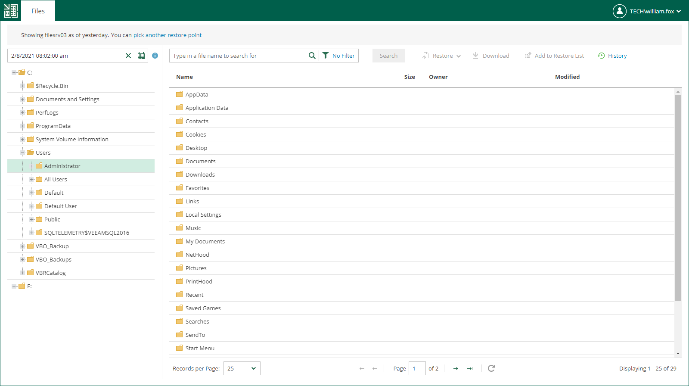

In this article

Veeam Backup Enterprise Manager streamlines delegation of restore capabilities: instead of multiple role assignments and restore scope fine-tuning, Enterprise Manager administrator can provide users that have local administrator rights on a Windows machine with a link to Self-Service File Restore Portal — a web UI that displays the controls for file-level restore of the protected machines.

This capability is supported by the Veeam runtime process which performs guest system indexing and also identifies local administrative accounts. Communication with the self-service webpage is performed over the HTTPS protocol. In particular, such delegation capabilities and self-service web portal can be used in enterprise deployments to elevate the first line support to perform in-place restores without administrative access.

Before You Begin

|  |
| --- |
| Note |
| * This functionality is supported only in the Enterprise Plus edition of Veeam Backup & Replication. * Self-Service File Restore Portal is available only for users of Microsoft Windows machines. For Linux-based machines, guest OS file restore is performed in the Veeam Backup Enterprise Manager UI under a user account configured in Enterprise Manager. For more information, see [Configuring Accounts and Roles](veeam_backup_em_roles.md). * Veeam Backup Enterprise Manager does not support guest OS files restore from storage snapshots. You can use the Veeam Backup & Replication console instead. |

To provide a user account with the ability to access Self-Service File Restore Portal, make sure the following prerequisites are met:

* The account belongs to the trusted or same domain as the Enterprise Manager server (for the user account to be resolved to SID). Users from untrusted domains cannot utilize self-restore.
* The account has local administrative rights for the required machine guest OS, local user rights are not sufficient.

|  |
| --- |
| Important |
| A Self-Service File Restore Portal user has access only to restore points created after the user is assigned with local administrator rights.  Machine restore points will stay available for self-restore to a user account whose local administrative rights were revoked after the restore point creation until the next restore point is created (then that user will not be able to access guest files any longer). |

Browsing Guest OS Files Through Self-Service Portal

To access the guest files in a machine backup:

1. Start the Self-Service File Restore Portal by clicking its icon in the list of applications or on the desktop. Alternatively, in the web browser address bar, enter the portal URL, for example:

|  |
| --- |
| https://enterprise\_manager\_host/selfrestore |

1. Enter the account credentials to log in. Use the DOMAIN\USERNAME format to specify the user name. The Files tab will open. By default, it displays guest OS files as of the latest restore point of the machine to which you logged in with local administrative rights.

1. To view guest files as of earlier restore point, click the Calendar icon and select the restore point. To view guest files of another machine (if available to you), use the Search field or the Pick from List link.
2. You can perform all operations supported for machine guest files by Veeam Backup Enterprise Manager. For more information on file browsing, search and restore, see [Browsing Machine Backups for Guest OS Files](browsing_vm_backups.md), [Searching for Guest OS Files in Machine Backups](searching_vm_backups.md), and [Performing 1-Click File Restore](performing_1-click_file_restore.md).

|  |
| --- |
| Note |
| If the Veeam Backup Enterprise Manager server is added to the Veeam ONE monitoring scope, the restore operations performed with Self-Service File Restore Portal are included in the [Restore Operator Activity](https://helpcenter.veeam.com/docs/one/userguide/restore_operator_activity.html?ver=13) report available in Veeam ONE. |

If no guest OS files are visible to the user, check the following reasons:

* The backup server that manages the job is not added to the Enterprise Manager infrastructure. For more information, see [Adding Backup Servers](adding_backup_server.md).
* The recent backup job data has not been yet collected from the backup server (default time interval is 15 minutes). For more information on how to run data collection manually, see [Collecting Data from Backup Servers](collecting_data_from_backup_servers.md).
* The Enable guest file system indexing option is turned off in the machine backup job. Edit the job setting and restart the job with indexing enabled.
* When the machine restore point was created, the user was not assigned local administrative rights. To access the guest OS files the user must be a part of the guest OS local administrator group.

If you cannot find your machine from the Pick from List window, you can select the I don't see my machine option to rebuild a security scope for your user account. Once complete, this action will reveal machines that were added to your security scope.

Disabling Self-Service File Restore Portal

You can prevent local administrators from accessing the self-service file restore functionality. You can do it by disabling Self-Service File Restore Portal. To disable the portal, change the Enterprise Manager registry key. For more information, contact [Veeam Customer Support](https://www.veeam.com/support.html).

Page updated 8/28/2025

Page content applies to build 13.0.1.1071
