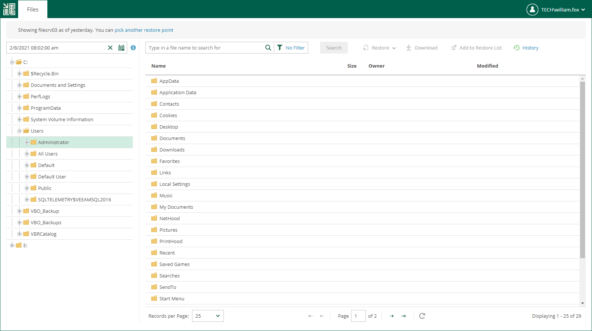

# Using Self-Service File Restore Portal to Restore Machine Guest Files

The Self-Service File Restore Portal is a web-based UI in Veeam Backup Enterprise Manager that lets users restore files from their own Windows machines. Users do not need any Enterprise Manager roles to use the portal. Access is granted automatically if the domain account of the user is identified as a local administrator on the protected machine.

The portal helps you delegate in-place file restores to end users or first-line support without granting administrative access to the backup infrastructure. To delegate file restores to local administrators, provide the users with a link to the Self-Service File Restore Portal.

Before You Begin

Before you use the Self-Service File Restore Portal, consider the following requirements and limitations:

* The Self-Service File Restore Portal supports restoring guest OS files only from Microsoft Windows machines. To restore guest OS files from Linux-based machines, use the main Enterprise Manager UI with a user account configured in Enterprise Manager. For more information, see [Configuring Accounts and Roles](veeam_backup_em_roles.md).
* To allow a user account to access the Self-Service File Restore Portal, make sure the account meets the following requirements:

* The user account is a domain account. Local accounts are not supported.
* The account belongs to the same or trusted domain as the Enterprise Manager server, so the user account to be resolved to a SID. Users from untrusted domains cannot use self-restore.
* The account has local administrator rights on the backed-up machine.

* A Self-Service File Restore Portal user have access only to restore points created after the user was granted local administrator rights on the backed-up machine. If local administrator rights are later revoked, the restore points remain available until the next restore point is created (after that, the user can no longer access guest files).
* Enterprise Manager does not support guest OS files restore from storage snapshots. You can use the Veeam Backup & Replication console instead.
* Self-Service File Restore Portal is supported only in the Enterprise Plus edition of Veeam Backup & Replication.
* If the Veeam Backup Enterprise Manager server is added to the Veeam ONE monitoring scope, restore operations performed with the Self-Service File Restore Portal are included in the [Restore Operator Activity](https://helpcenter.veeam.com/docs/one/userguide/restore_operator_activity.html?ver=13) report in Veeam ONE.

Browsing Guest OS Files Through Self-Service Portal

To access the guest files in a machine backup:

1. Start the Self-Service File Restore Portal by clicking its icon in the list of applications or on the desktop. Alternatively, in the web browser, specify the portal URL in the following format:

|  |
| --- |
| https://<enterprise\_manager\_address>/selfrestore |

Note that the communication with the portal is performed over the HTTPS protocol.

1. Enter the account credentials to log in. Use the DOMAIN\USERNAME format to specify the user name. The Files tab will open. By default, it displays guest OS files as of the latest restore point of the machine to which you logged in with local administrative rights.

1. To view guest files as of earlier restore point, click the Calendar icon and select the restore point. To view guest files of another machine (if available to you), use the Search field or the Pick from List link.
2. You can perform all operations supported for machine guest files by Veeam Backup Enterprise Manager. For more information on file browsing, search and restore, see [Browsing Machine Backups for Guest OS Files](browsing_vm_backups.md), [Searching for Guest OS Files in Machine Backups](searching_vm_backups.md), and [Performing 1-Click File Restore](performing_1-click_file_restore.md).

Troubleshooting

If no guest OS files are visible to the user, check the following reasons:

* The backup server that manages the job is not added to the Enterprise Manager infrastructure. For more information, see [Adding Backup Servers](adding_backup_server.md).
* The recent backup job data has not been yet collected from the backup server (default time interval is 15 minutes). For more information on how to run data collection manually, see [Collecting Data from Backup Servers](collecting_data_from_backup_servers.md).
* The Enable guest file system indexing option is turned off in the machine backup job. Edit the job setting and restart the job with indexing enabled.
* When the machine restore point was created, the user was not assigned local administrative rights. To access the guest OS files the user must be a part of the guest OS local administrator group.

If you cannot find your machine from the Pick from List window, you can select the I don't see my machine option to rebuild a security scope for your user account. Once complete, this action will reveal machines that were added to your security scope.

Disabling Self-Service File Restore Portal

You can prevent local administrators from accessing the self-service file restore functionality. You can do it by disabling Self-Service File Restore Portal. To disable the portal, change the Enterprise Manager registry key. For more information, contact [Veeam Customer Support](https://www.veeam.com/support.html).

