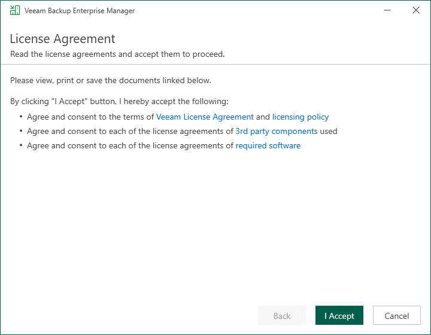

In this article

At the License Agreement step of the wizard, read Veeam License Agreement and licensing policy as well as license agreements of 3rd party components that Veeam incorporates and license agreements of required software. To accept the license agreements and continue installing Veeam Backup Enterprise Manager, click I Accept.

Page updated 10/3/2025

Page content applies to build 13.0.1.1071
