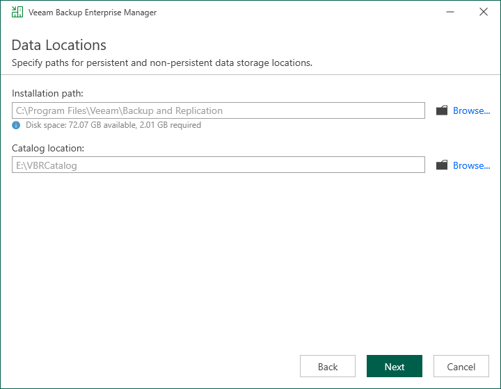

# Step 9. Specify Data Locations

The Data Locations step is available if you have selected to configure installation settings manually and to install a new instance of the database server.

At this step of the wizard, you can specify an installation folder and a folder for the guest file system catalog.

1. To change the default installation folder, click Browse next to the Installation path field.

The default installation folder is %ProgramFiles%\Veeam\Backup and Replication.

1. To change a path to the folder where index files must be stored, click Browse next to the Catalog location field. Indexing data is required for browsing and searching for VM guest OS files inside backups and performing 1-click restore.

By default, the setup wizard creates the VBRCatalog folder on a volume with the maximum amount of free space, for example: C:\VBRCatalog.

