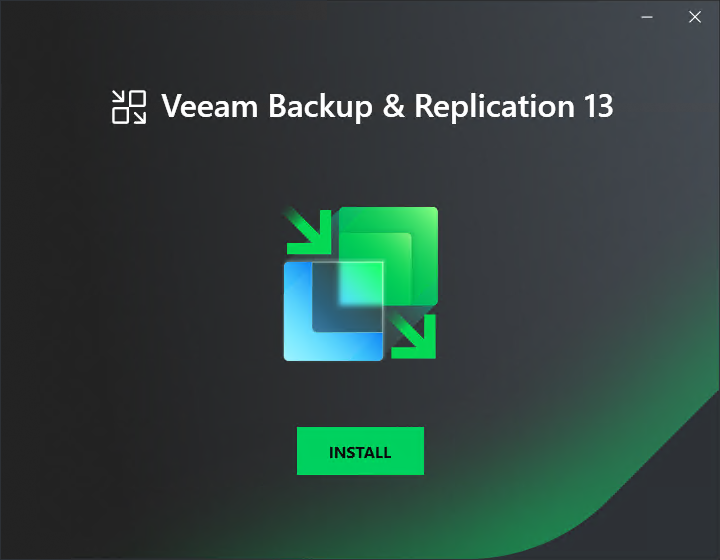

In this article

To start the setup wizard, take the following steps:

1. Download the latest version of the Veeam Backup & Replication installation image from the [Veeam Product Downloads](https://www.veeam.com/downloads.html) page.
2. Mount the installation image to the machine where you plan to install Veeam Backup Enterprise Manager or burn the image file to a flash drive or other removable storage device. If you plan to install Veeam Backup Enterprise Manager on a VM, use built-in tools of the virtualization management software to mount the installation image to the VM.

To extract the content of the ISO file, you can also use the latest versions of utilities that can properly extract data from ISO files of large size and can properly work with long file paths.

1. After you mount the image or insert the disk, Autorun opens a splash screen. If Autorun is not available or disabled, run the Setup.exe file from the image or disk.
2. Click Install.

|  |
| --- |
| Important |
| It is strongly recommended that you install Veeam Backup Enterprise Manager using Autorun or the Setup.exe file. If you run other installation files from the ISO folders, you may miss some components that need to be installed, and Veeam Backup Enterprise Manager may not work as expected. |

Page updated 10/29/2025

Page content applies to build 13.0.1.1071
