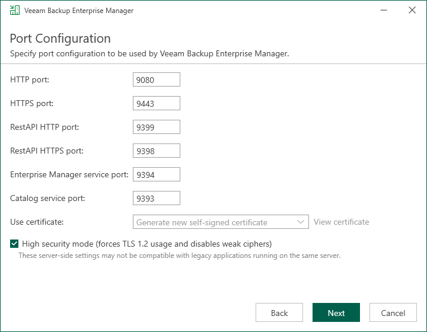

In this article

The Port Configuration step of the wizard is available if you have selected to configure installation settings manually.

At this step of the wizard, you can customize ports that will be used for communication between backup infrastructure components. For more information about Veeam Backup Enterprise Manager used ports, see [Ports](used_ports.md).

1. Provide HTTP and HTTPS port numbers.
2. Specify the certificate to be used by Veeam Backup Enterprise Manager. This certificate is needed to establish secure communication with the Enterprise Manager website using HTTPS; Veeam plug-in for vSphere Client and REST API client also will use this certificate to receive data using HTTPS protocol. If the setup wizard does not find an appropriate certificate, it will generate a self-signed certificate.

Click View certificate to review the details of the selected certificate.

1. To enforce TLS 1.2 encryption protocol for network connections, select the High security mode check box.

This option disables using weak ciphers for all communications with the machine on which Veeam Backup Enterprise Manager runs. This may interfere with the operation of 3rd party software installed on the same machine.

Page updated 10/29/2025

Page content applies to build 13.0.1.1071
