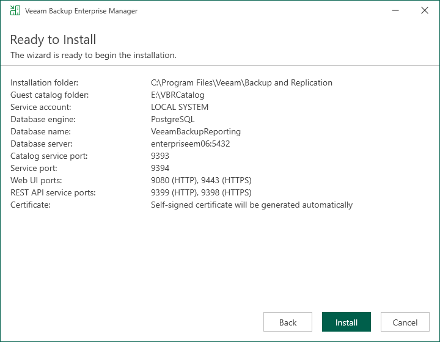

# Step 11. Begin Installation

The Ready to Install step of the wizard is available if you have selected to configure installation settings manually.

At this step of the wizard, you can review the Veeam Backup Enterprise Manager installation settings and start the installation process:

1. Click Install to begin the installation.
2. Wait for the installation process to complete and click Finish to exit the setup wizard.

