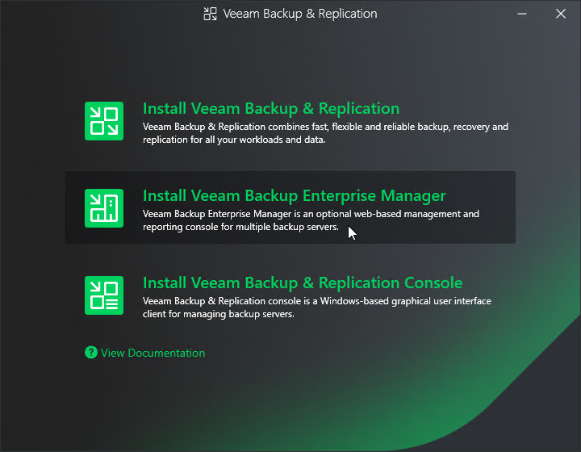

In this article

At this step of the wizard, select Install Veeam Backup Enterprise Manager.

To open Veeam Help Center from the setup wizard, click View Documentation.

Page updated 10/29/2025

Page content applies to build 13.0.1.1071
