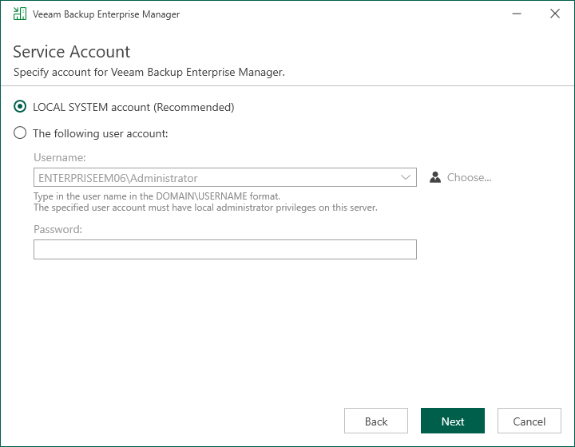

In this article

The Service Account step of the wizard is available if you have selected to configure installation settings manually.

You can select an account under which you want to run the Veeam Backup Enterprise Manager Service:

* LOCAL SYSTEM account (recommended, used by default)
* Another user account

The user name of the custom account must be specified in the DOMAIN\USERNAME format.

|  |
| --- |
| Note |
| The user account must have Veeam Backup Enterprise Manager service account permissions to run the Veeam Backup Enterprise Manager Service. For more information, see [Permissions](required_permissions.md). |

Page updated 10/3/2025

Page content applies to build 13.0.1.1071
