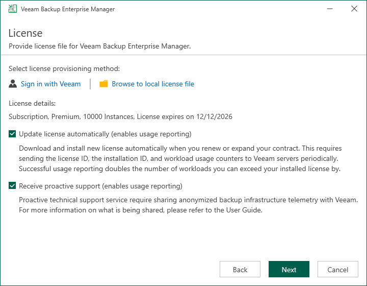

In this article

At the License step of the wizard, specify what license you want to install for Veeam Backup Enterprise Manager. You can leave the license file used in the previous version of Veeam Backup Enterprise Manager or install a new one.

To install a license, choose one of the following options:

* Browse your local server or network locations for a license file:

1. Click Browse to local license file.
2. Choose a valid license file for Veeam Backup Enterprise Manager.

* Select a license from your account at the Veeam website:

1. Click Sign in with Veeam.
2. Enter your credentials for accessing the Veeam website and click Sign in.
3. Select one of the available licenses and click Install selected license.

To install new licenses automatically when you renew or expand your contract, select the Update license automatically check box. If you enable the automatic license update, and therefore enable usage reporting, you will double the number of workloads by which you can exceed your installed license. For more information on license update, see [Updating License](em_license_update.md).

To receive proactive technical support services, select the Receive proactive support check box. Selecting this option also enables diagnostic data sharing. To learn how sensitive data is processed, see [Processing of Sensitive Data in Veeam Technical Support](https://www.veeam.com/processing_of_sensitive_data_in_support_ds.pdf).

Page updated 10/29/2025

Page content applies to build 13.0.1.1071
